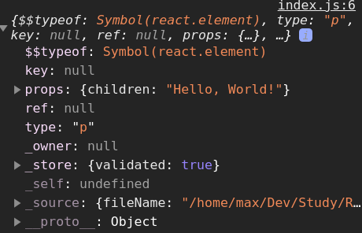
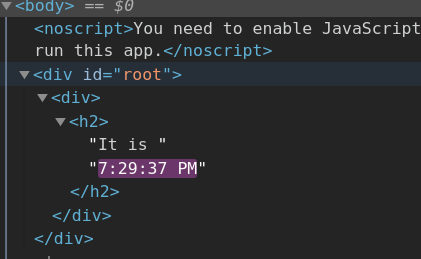
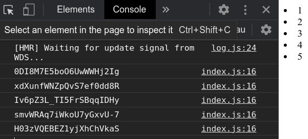
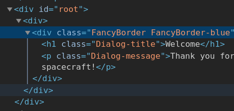

# React Intro

- [React Intro](#react-intro)
	- [Sources](#sources)
	- [Install & Run](#install--run)
	- [JSX](#jsx)
	- [Rendering Elements](#rendering-elements)
	- [Components and Props](#components-and-props)
	- [State and Lifecycle](#state-and-lifecycle)
	- [Events](#events)
	- [Conditional Rendering](#conditional-rendering)
	- [Lists and Keys](#lists-and-keys)
	- [Forms](#forms)
		- [Controlled components](#controlled-components)
			- [`text`](#text)
			- [`textarea`](#textarea)
			- [`select`](#select)
		- [Multiple Inputs](#multiple-inputs)
		- [Uncontrolled components](#uncontrolled-components)
			- [`file`](#file)
	- [Lifting State Up](#lifting-state-up)
	- [Composition vs Inheritance](#composition-vs-inheritance)
	- [Basic project](#basic-project)
	- [Components](#components)
	- [`prop-types`](#prop-types)
	- [Tic Tac Toe example](#tic-tac-toe-example)

***


## Sources

1. https://reactjs.org - ref
2. https://www.youtube.com/watch?v=xJZa2_aldDs - minin
3.
4. https://github.com/facebook/react/issues/1342#issuecomment-39230939 - unique keys
5. https://stackoverflow.com/a/43892905/12166570 - unique keys

***


## Install & Run

To start the basic project, use `create-react-app`

```bash
npx create-react-app Test
cd Test
npm start
```

It's a good practice to use these extra tools:

```bash
npm i prop-types	# lib to set types of props
```

Usually our project will have the main `public/index.html` file with a single `div` element:

```html
<div id="root"></div>
```

This root container will contain our App that will be generated dynamically.

```js
// index.js
import React from 'react'
import ReactDOM from 'react-dom'
ReactDOM.render(<h1>Hello, world!</h1>, document.getElementById('root'))
```

***


## JSX

**JSX is basically HTML elements with JS insertions inside.** From the JS perspective, JSX elements are **objects**.

```js
const jsx = <p>Hello, World!</p>
console.log(jsx)
ReactDOM.render(jsx, document.getElementById('root'))
```



***

Put any valid JS expression inside the **curly braces `{}`** in JSX.

```js
// index.js
import React from 'react'
import ReactDOM from 'react-dom'
import './index.css'

function formatName(user) {
	return user.firstName + ' ' + user.lastName
}

const user = {
	firstName: 'Harper',
	lastName: 'Perez'
}

const element = <h1>Hello, {formatName(user)}!</h1>

ReactDOM.render(element, document.getElementById('root'))
```

***

JSX elements are objects, we can use them in JS any way we want: in `if`, loops, functions etc. 

```js
function format(jsx) {
	return <h1>{jsx}</h1>
}

const jsx = <span>Hello, World!</span>

ReactDOM.render(format(jsx), document.getElementById('root'))
```

These two examples are identical and eventually turn into the same object:

```js
// This
const element = <h1 className="greeting">Hello, world!</h1>
// is the same as this
const element = React.createElement(
	'h1',
	{ className: 'greeting' },
	'Hello, world!'
)

// and are both eventually turn into this (simplified) object
const element = {
  type: 'h1',
  props: {
    className: 'greeting',
    children: 'Hello, world!'
  }
}
```

***

JSX elements can have child elements the same way as in HTML. If they don't - they can be **self-enclosing** (as in XML).

```js
const container = (
	<div>
		<input type="text" />
	</div>
)
```

***

Passing **attributes**, we use either **double quotes** for string literals (as we do in HTML)

```js
const element = <div tabIndex="0"></div>
```

or **curly braces** for JS expressions.

```js
function zero(){
	return 0
}
const element = <div tabIndex={zero()}></div>
```

**Don't** put double quotes if you use curly braces!

***

**JSX Prevents Injection Attacks!** 

It is safe to embed user input in JSX because `React DOM` **escapes** any values embedded in JSX before rendering them. Everything is converted to **strings** before being rendered.

```js
const title = response.potentiallyMaliciousInput
// This is safe:
const element = <h1>{title}</h1>
```

***


## Rendering Elements

Unlike browser DOM elements, React elements are plain objects, and are cheap to create. `React DOM` takes care of updating the DOM to match the React elements.

`ReactDOM.render (jsxElement, rootElement)` is responsible for rendering

```js
import React from 'react'
import ReactDOM from 'react-dom'

const container = (
	<div>
		<input type="text" />
	</div>
)

ReactDOM.render(container, document.getElementById('root'))
```

***

**REACT ELEMENTS ARE IMMUTABLE**

Once you create an element, you can’t change its children or attributes. An element is like a single frame in a movie: it represents the UI at a certain point in time, and you can't go back - you can only create a new frame.

Thus, the obvious way to update the UI is to create a **new element** and pass it to `ReactDOM.render()`

```js
function tick() {
	const element = (
		<div>
			<h2>It is {new Date().toLocaleTimeString()}.</h2>
		</div>
	)
	ReactDOM.render(element, document.getElementById('root'))
}

setInterval(tick, 1000)
```

But in practice we usually only call `ReactDOM.renader()` once and then we **update the state** (see below).

***

**REACT ONLY UPDATES WHAT"S NECESSARY**

It compares the element and its children to the previous one, and only applies the DOM updates necessary to bring the DOM to the desired state.

You can make sure of it opening the previous example in the DevTools: even though we create an element describing the whole UI tree on every tick, only the text node whose contents have changed gets updated by React DOM.



Thus, **the React concept is thinking about how the UI should look at any given moment, rather than how to change it over time.**

***


## Components and Props

Components let you split the UI into independent, reusable pieces, and think about each piece in isolation.

Conceptually, components are like JS functions. They accept arbitrary inputs (called “props”) and return React elements describing what should appear on the screen.

The two components below are equivalent from React's point of view:

```js
// Function component

function Welcome(props) {
	return <h1>Hello, {props.name}</h1>
}

ReactDOM.render(Welcome({ name: 'max' }), document.getElementById('root'))


// Class component

class Welcome extends React.Component {
	render() {
		return <h1>Hello, {this.props.name}</h1>
	}
}

ReactDOM.render(<Welcome name={'max'} />, document.getElementById('root'))
```

JSX attributes and children are passed to the user-defined components **as a single object parameter** usually called "**props**".

**Always start component names with a capital letter** as components starting with lowercase letters are treated as the usual DOM tags. 

***

Typically, new React apps have a single `App` component at the very top, while all the other components are nested inside.

```js
function Welcome(props) {
	return <h1>Hello, {props.name}</h1>
}

function App() {
	return (
		<div>
			<Welcome name="Sara" />
			<Welcome name="Cahal" />
			<Welcome name="Edite" />
		</div>
	)
}

ReactDOM.render(<App />, document.getElementById('root'))
```

***

**It's a good practice to split components into smaller components.**

See examples below.

***

**Props are Read-Only**.

All React components must act like **pure functions** with respect to their props. This means they don't have to change their `props` (parameters).

***


## State and Lifecycle

Earlier we only called `ReactDOM.render()` to change the rendered output. The better way to do it is through changing the **`state`**.

Set state|Where and when|Notes
-|-|-
`this.state = {}`|In the `constructor`|We can only set the **state** directly in the `constructor`
`this.setState({})` or `this.setState((prevState, props) => {})`|Anywhere **after** the component was **mounted**|The proper way of updating the component

***

**State updates may be asynchronous**

React may batch multiple `setState()` calls into a single update for performance. 

You cannot rely on the previous state values calculating the next state:

```js
this.setState({
  counter: this.state.counter + this.props.increment,
})
```

To fix this, use **the second form** of `setState` with a **callback** receiving the previous state and the current props:

```js
this.setState((prevState, props) => ({
  counter: prevState.counter + props.increment
}))
```

***

**State Updates are Merged**

When you call `setState()`, React **merges** the object you provide into the current state.

Example

```js
constructor(props) {
	super(props);
	this.state = {
		posts: [],
		comments: []
	}
}

componentDidMount() {
	// We only updated `comments` leaving `posts` intact - they are NOT removed
	fetchComments().then(response => {
		this.setState({
			comments: response.comments
		})
	})
}
```

***

**The data flows down** 

The state is encapsulated in the component and may only affect components "below" the tree:

```js
<FormattedDate date={this.state.date} />
```

Also note that components may have **no state at all**.

***

There are special **lifecycle methods** in the component class for handling "**mounting**" (when the component is rendered in DOM) and "**unmounting**" (when the component is cleared):

- `componentDidMount()` - runs after the component output has been rendered to the DOM
- `componentWillUnmount()` - runs before the component is destroyed (e.g. before rendering the updated state)

```js
import React from 'react'
import ReactDOM from 'react-dom'

class Clock extends React.Component {
	constructor(props) {
		console.log('comstructor')
		super(props)
		// Set the initial state (the first timestamp that will be displayed)
		this.state = { date: new Date() }
	}

	// Called one time after the first `render()` call
	componentDidMount() {
		console.log('didMount')
		this.timerId = setInterval(() => this.tick(), 1000)
	}

	// In our example this will never be called (because our element never gets removed from DOM), but it's it's a good practice to clear resources when we don't need them anymore
	componentWillUnmount() {
		console.log('willMount')
		clearInterval(this.timerId)
	}

	// This method will be called each time the state is updated to re-render changes
	render() {
		console.log('render')
		return (
			<div>
				<h2>It is {this.state.date.toLocaleTimeString()}.</h2>
			</div>
		)
	}

	tick() {
		console.log('tick')
		// Update the state
		this.setState({ date: new Date() })
	}
}

ReactDOM.render(<Clock />, document.getElementById('root'))
```

***


## Events

Events are names using **camelCase**.

Handlers for the component are usually place inside of it.

When using React, you generally don’t need to to add listeners to a DOM element after it is created. Instead, just provide a listener when the element is initially rendered.

Don't forget to bind `this`!

Example: on/off button

```js
class Toggle extends React.Component {
	constructor(props) {
		super(props)
		this.state = { isToggleOn: true }

		// This binding is necessary to make `this` work in the callback
		this.handleClick = this.handleClick.bind(this)
	}

	handleClick() {
		this.setState((state) => ({
			isToggleOn: !state.isToggleOn
		}))
	}

	render() {
		return (
			<button onClick={this.handleClick}>
				{this.state.isToggleOn ? 'ON' : 'OFF'}
			</button>
		)
	}
}

ReactDOM.render(<Toggle />, document.getElementById('root'))
```

To **pass arguments to event handlers**, use any of the 2 methods:

```js
<button onClick={(e) => this.deleteRow(id, e)}>Delete Row</button>
<button onClick={this.deleteRow.bind(this, id)}>Delete Row</button>
```

In both cases `e` will be passed as the last argument (in the second example - automatically).

***


## Conditional Rendering

Often we have to render components with different input parameters depending os some conditions. The easier way to do it is with **ternary operator**. But you can also use simple `if`.

Example: login/logout button and message

```js
import React from 'react'
import ReactDOM from 'react-dom'

function App() {
	return (
		<div>
			<LoginControl />
		</div>
	)
}

function UserGreeting(props) {
	return <h2>Welcome back!</h2>
}

function GuestGreeting(props) {
	return <h2>Please sign in</h2>
}

function Greeting(props) {
	if (props.isLoggedIn) {
		return <UserGreeting />
	}
	return <GuestGreeting />
}

function Button(props) {
	return <button onClick={props.onClick}>{props.textContent}</button>
}

class LoginControl extends React.Component {
	constructor(props) {
		super(props)
		this.state = { isLoggedIn: false }

		this.handleLogIn = this.handleLogIn.bind(this)
		this.handleLogOut = this.handleLogOut.bind(this)
	}

	handleLogIn() {
		this.setState({ isLoggedIn: true })
	}

	handleLogOut() {
		this.setState({ isLoggedIn: false })
	}

	render() {
		const button = this.state.isLoggedIn ? (
			<Button onClick={this.handleLogOut} textContent="Logout" />
		) : (
			<Button onClick={this.handleLogIn} textContent="Login" />
		)
		return (
			<div>
				<Greeting isLoggedIn={this.state.isLoggedIn} />
				{button}
			</div>
		)
	}
}

ReactDOM.render(<App />, document.getElementById('root'))
```

***

To **prevent component from rendering** when it was called by another component, set a condition and `return null`:

```js
function WarningBanner(props) {
  if (!props.warn) {
    return null
  }

	return <div>Warning<div>
}

// ... later when we call it:
<WarningBanner warn={this.state.showWarning} />
```

***


## Lists and Keys

List:

```js
function App() {
	return (
		<div>
			<NumberList numbers={[1, 2, 3, 4, 5]} />
		</div>
	)
}

function NumberList(props) {
	return props.numbers.map((number) => <li>{number}</li>)
}
```


The one thing missing here is **unique keys** for every element of the list. 

***

Keys are **unique identifiers** that React uses to distinguish elements of the same kind between each other. 

If they are missing, React will work unoptimally - e.g. rerender all elements each time some of them changed (because it doesn't know what elements should be updated and what - should not).

Useful sources:

1. Why keys should be unique: https://reactjs.org/docs/reconciliation.html#recursing-on-children
2. Why you shouldn't use *indices* as keys and what you **ahould** use: https://robinpokorny.medium.com/index-as-a-key-is-an-anti-pattern-e0349aece318

Note: 

1. Don't use *indices* or *Math.random()* to generate keys. Use [nanoid](https://github.com/ai/nanoid/) or UUID.

```js
import React from 'react'
import ReactDOM from 'react-dom'
import { nanoid } from 'nanoid'

function App() {
	return (
		<div>
			<NumberList numbers={[1, 2, 3, 4, 5]} />
		</div>
	)
}

function NumberList(props) {
	return props.numbers.map((number) => {
		const key = nanoid()	// generated unique key
		console.log(key)
		return <li key={key}>{number}</li>
	})
}

ReactDOM.render(<App />, document.getElementById('root'))
```



2. Keys should only be unique among siblings - no need to make them unique globally.
3. Keys only make sense in the context of the surrounding array. There's no need to specify them inside the component returning a single element - you should instead specify them as props when you call that component:

BAD:

```js
function ListItem(props) {
  return (
    <li key={props.value.toString()}>
      {props.value}
    </li>
  )
}

<ListItem value={number} />
```

GOOD:

```js
function ListItem(props) {
  return (
    <li>{props.value}</li>
  )
}

<ListItem key={number.toString()} value={number} />
```

***


## Forms

Forms can be tricky in React. You might want to use [formik](https://formik.org) to handle them better.

### Controlled components

Only get updated explicitly with `setState()`. It literally means that unless we manually `onChange={setState()}` our component, its value will never change (even if user makes an input). So the value displayed always corresponds to the inner state.

Specifying `value` on a controlled component prevents the user from changing the input unless you desire so.

```js
ReactDOM.render(<input value={ku} />, document.getElementById('root'))
// This input is immutable
```

There are 2 ways to change the value of such a component:

1. Set `onChange` handler that will `setState()`
2. Set `value={null}` or `value={undefined}`

***

#### `text`

```js
import React from 'react'
import ReactDOM from 'react-dom'

function App() {
	return (
		<div>
			<NameForm />
		</div>
	)
}

class NameForm extends React.Component {
	constructor(props) {
		super(props)
		this.state = { value: '' }

		this.handleChange = this.handleChange.bind(this)
		this.handleSumbit = this.handleSumbit.bind(this)
	}

	// Without this, you won't be able to change the input value
	handleChange(e) {
		this.setState({ value: e.target.value })
	}

	handleSumbit(e) {
		console.log(this.state.value)
		e.preventDefault()
	}

	render() {
		return (
			<form onSubmit={this.handleSumbit}>
				<label>
					Name:
					<input type="text" onChange={this.handleChange} />
				</label>
				<button type="submit">Submit</button>
			</form>
		)
	}
}

ReactDOM.render(<App />, document.getElementById('root'))
```

***

#### `textarea`

The `value` attribute stores the content. 

The example is the same as above with minor changes.

```js
// constructor...
this.state = { value: 'Write your essay here...' }
// render...
<textarea value={this.state.value} onChange={this.handleChange} />
```

***

#### `select`

The `value` attribute indicates the **selected** option. 

The example is the same as above with minor changes.

```js
// constructor...
this.state = { value: 'coconut' }
// render...
<select value={this.state.value} onChange={this.handleChange}>
	<option value="grapefruit">Grapefruit</option>
	<option value="lime">Lime</option>
	<option value="coconut">Coconut</option>
	<option value="mango">Mango</option>
</select>
```

***


### Multiple Inputs

Set the `name` property for inputs to handle them based on their `e.target.name`

```js
import React from 'react'
import ReactDOM from 'react-dom'

function App() {
	return (
		<div>
			<Reservation />
		</div>
	)
}

class Reservation extends React.Component {
	constructor(props) {
		super(props)
		this.state = { isGoing: true, numberOfGuests: 2 }

		this.handleInputChange = this.handleInputChange.bind(this)
	}

	handleInputChange(e) {
		const target = e.target
		let value
		if (target.type === 'checkbox') {
			value = target.checked
		} else if (target.type === 'number') {
			value = Number(target.value)
		}
		this.setState({
			[target.name]: value
		})
		console.log(this.state)
	}

	render() {
		return (
			<form>
				<label>
					Is going:
					<input
						name="isGoing"
						type="checkbox"
						checked={this.state.isGoing}
						onChange={this.handleInputChange}
					/>
				</label>
				<br />
				<label>
					Number of guests:
					<input
						name="numberOfGuests"
						type="number"
						value={this.state.numberOfGuests}
						onChange={this.handleInputChange}
					/>
				</label>
				<button type="submit">Submit</button>
			</form>
		)
	}
}

ReactDOM.render(<App />, document.getElementById('root'))
```

***


### Uncontrolled components

Sometimes it becomes annoying to use **controlled** components, because you need to write an event handler for every way your data can change and pipe all of the input state through a React component. In these situations you might want to use **uncontrolled** components.


#### `file`

`<input type="file" />` is always an **uncontrolled** component because its value can only be set by a user, and not programmatically.

You should use the `File API` to interact with the files. The following example shows how to create a *ref to the DOM node* to access file(s):

```js

```

***


## Lifting State Up

https://reactjs.org/docs/lifting-state-up.html

Often, several components need to reflect the same changing data. Lift the shared state up to their closest common ancestor.

In React, sharing state is accomplished by moving it up to the closest common ancestor of the components that need it. This is called “lifting state up”.

**Example**: the temperature calculator where two inputs share the same state.

For this, we remove the local state from the `TemperatureInput` and move it into the `Calculator`

The inputs stay in sync because their values are computed from the same state (of the parent `Calculator`).

```js
import React from 'react'
import ReactDOM from 'react-dom'

const scaleNames = {
	c: 'Celsius',
	f: 'Fahrenheit'
}

function BoilingVerdict(props) {
	if (props.celsius >= 100) {
		return <p>The water would boil.</p>
	}
	return <p>The water would not boil.</p>
}

function toCelsius(fahrenheit) {
	return ((fahrenheit - 32) * 5) / 9
}

function toFahrenheit(celsius) {
	return (celsius * 9) / 5 + 32
}

function tryConvert(temperature, convertFn) {
	const input = parseFloat(temperature)
	if (isNaN(input)) {
		return ''
	}
	const output = Math.round(convertFn(input) * 1000) / 1000
	return output.toString()
}

class TemperatureInput extends React.Component {
	constructor(props) {
		super(props)
		this.state = { temperature: props.temperature }
		this.handleChange = this.handleChange.bind(this)
	}

	handleChange(e) {
		this.props.onTemperatureChange(e.target.value)
	}

	render() {
		const temperature = this.props.temperature
		return (
			<fieldset>
				<legend>Enter temperature in {scaleNames[this.props.scale]}</legend>
				<input value={temperature} onChange={this.handleChange} />
			</fieldset>
		)
	}
}

class Calculator extends React.Component {
	constructor(props) {
		super(props)
		this.state = { temperature: '', scale: 'c' }
		this.handleCelsuisChange = this.handleCelsuisChange.bind(this)
		this.handleFahrenheitChange = this.handleFahrenheitChange.bind(this)
	}

	handleCelsuisChange(temperature) {
		this.setState({ scale: 'c', temperature })
	}

	handleFahrenheitChange(temperature) {
		this.setState({ scale: 'f', temperature })
	}

	render() {
		const celsius =
			this.state.scale === 'c'
				? this.state.temperature
				: tryConvert(this.state.temperature, toCelsius)
		const fahrenheit =
			this.state.scale === 'f'
				? this.state.temperature
				: tryConvert(this.state.temperature, toFahrenheit)
		return (
			<div>
				<TemperatureInput
					scale="c"
					temperature={celsius}
					onTemperatureChange={this.handleCelsuisChange}
				/>
				<TemperatureInput
					scale="f"
					temperature={fahrenheit}
					onTemperatureChange={this.handleFahrenheitChange}
				/>
				<BoilingVerdict celsius={celsius} />
			</div>
		)
	}
}

function App() {
	return (
		<div>
			<Calculator />
		</div>
	)
}

ReactDOM.render(<App />, document.getElementById('root'))
```

***


## Composition vs Inheritance

Composition is good, it helps reusing code between components.

Some components don’t know their children ahead of time (e.g. sidebars). The good practice is to pass child elements through the `children` property directly into their output.

```js
function FancyBorder(props) {
  return (
    <div className={'FancyBorder FancyBorder-' + props.color}>
      {props.children}
    </div>
  )
}
```

This lets other components pass arbitrary children to them by nesting the JSX:

```js
function WelcomeDialog() {
  return (
    <FancyBorder color="blue">
      <h1 className="Dialog-title">
        Welcome
      </h1>
      <p className="Dialog-message">
        Thank you for visiting our spacecraft!
      </p>
    </FancyBorder>
  )
}
```

Anything inside the `<FancyBorder>` JSX tag gets passed into the `FancyBorder` component as a `children` prop. Note how the child elements got inside the `div` with classes:




***


## Basic project

Project structure (based on `create-react-app` with deleted clutter):

```
node_modules
public
src
	AddTask.js
	Todolist.js
	Todoitem.js
App.js
context.js
index.css
index.js
reportWebVitals.js
```

**App.js** - our application front-end

```js
import React from 'react'
import Todolist from './Todo/TodoList'
// Context lets us pass functions through the components
import Context from './context'
import AddTask from './Todo/AddTask'

function App() {
	// `tasks` - the initial state
	// `setTasks` - function to call when we set the new state
	// `useState` hook is used to change the state, it accepts the initial state and returns an array with 2 params
	const [tasks, setTasks] = React.useState([
		{ id: 1, completed: false, title: 'Buy bread' },
		{ id: 2, completed: true, title: 'Buy butter' },
		{ id: 3, completed: false, title: 'Buy milk' }
	])

	function toggleTask(id) {
		// This function should accept the similar array of tasks as we passed setting the initial state. And this should be a NEW array, the old object will be considered the same state and won't trigger re-render!
		setTasks(
			tasks.map((task) => {
				if (task.id === id) {
					task.completed = !task.completed
				}
				return task
			})
		)
	}

	function removeTask(id) {
		setTasks(tasks.filter((task) => task.id !== id))
		console.log(tasks)
	}

	function addTask(title) {
		setTasks([
			...tasks,
			{
				title,
				id: Date.now(),
				completed: false
			}
		])
	}

	return (
		// To use Context, we should wrap our main element with the Context provider
		<Context.Provider value={{ removeTask }}>
			<div className="wrapper">
				<h1>React tutorial</h1>
				<AddTask onCreate={addTask} />
				{tasks.length ? (
					<Todolist tasks={tasks} myOnToggle={toggleTask} />
				) : (
					<p>No tasks</p>
				)}
			</div>
		</Context.Provider>
	)
}

export default App
```

**Todolist.js** - the list component

```js
import React from 'react'
import PropTypes from 'prop-types'
import Todoitem from './TodoItem'

const styles = {
	ul: {
		listStyle: 'none'
	}
}

function Todolist({ tasks, myOnToggle }) {
	return (
		<ul style={styles.ul}>
			{tasks.map((task, i) => (
				<Todoitem task={task} key={task.id} index={i} myOnChange={myOnToggle} />
			))}
		</ul>
	)
}

Todolist.propTypes = {
	tasks: PropTypes.arrayOf(PropTypes.object).isRequired,
	myOnToggle: PropTypes.func.isRequired
}

export default Todolist
```

**TodoItem.js** - the list item component

```js
import React, { useContext } from 'react'
import PropTypes from 'prop-types'
import Context from '../context'

// Example of in-script styles; outer styles live in regular CSS
const styles = {
	li: {
		display: 'flex',
		justifyContent: 'space-between',
		alignItems: 'center',
		padding: '.5rem 1rem',
		border: '1px solid #ccc',
		borderRadius: '4px',
		marginBottom: '.5rem'
	},
	input: {
		marginRight: '1rem'
	}
}

function TodoItem({ task, index, myOnChange }) {
	// Using the context, we can avoid touching the `TodoList` layer
	const { removeTask } = useContext(Context)

	const classes = []
	if (task.completed) {
		classes.push('done')
	}

	return (
		<li style={styles.li}>
			<span className={classes.join(' ')}>
				<input
					type="checkbox"
					checked={task.completed}
					style={styles.input}
					onChange={() => myOnChange(task.id)}
				/>
				<strong>{++index}) </strong>
				{task.title}
			</span>

			{/* Example of CSS class connection*/}
			<button className="rm" onClick={removeTask.bind(null, task.id)}>
				&times;
			</button>
		</li>
	)
}

TodoItem.propTypes = {
	task: PropTypes.object.isRequired,
	index: PropTypes.number,
	myOnChange: PropTypes.func.isRequired
}

export default TodoItem
```

**Add task** - form for adding new tasks

```js
import React, { useState } from 'react'
import PropTypes from 'prop-types'

// Out custom hook
function useInputValue(defaultValue = '') {
	const [value, setValue] = useState(defaultValue)
	return {
		bind: {
			value,
			onChange: (e) => setValue(e.target.value)
		},
		clear: () => setValue(''),
		value: () => value
	}
}

function AddTask({ onCreate }) {
	const input = useInputValue('')

	function submitForm(e) {
		e.preventDefault()
		if (input.value().trim()) {
			onCreate(input.value())
			// You should change the state, not just try to update the input value!
			input.clear()
		}
	}

	return (
		<form style={{ marginBottom: '1rem' }} onSubmit={submitForm}>
			<input type="text" {...input.bind} />
			<button type="submit">Add task</button>
		</form>
	)
}

AddTask.propTypes = {
	onCreate: PropTypes.func.isRequired
}

export default AddTask
```

**index.css**

```css
body {
	margin: 0;
	font-family: -apple-system, BlinkMacSystemFont, 'Segoe UI', 'Roboto',
		'Oxygen', 'Ubuntu', 'Cantarell', 'Fira Sans', 'Droid Sans',
		'Helvetica Neue', sans-serif;
	-webkit-font-smoothing: antialiased;
	-moz-osx-font-smoothing: grayscale;
}

code {
	font-family: source-code-pro, Menlo, Monaco, Consolas, 'Courier New',
		monospace;
}

ul {
	margin: 0;
	padding: 0;
}

.wrapper {
	padding-top: 5rem;
	margin: 0 auto;
	width: 600px;
}

.rm {
	color: #fff;
	background-color: red;
	border: none;
	border-radius: 50%;
}

.done {
	text-decoration: line-through;
}
```

***

## Components

**NB**: Your components should always:

1. `import React from 'react'`
2. `export` something (function / class)

***

## `prop-types`

This lib provides type validation for props.

```js
// Todoitem.js
import PropTypes from 'prop-types'

function Todoitem({ task, index }) {
	/* ... */
}

Todoitem.propTypes = {
	task: PropTypes.object.isRequired,
	index: PropTypes.number
}

export default Todolist
```

Such validation you do for all your components and their props.

***

## Tic Tac Toe example

https://reactjs.org/tutorial/tutorial.html#setup-for-the-tutorial

We begin with:

```bash
npx create-react-app Tic Tac Toe
cd 'Tic Tac Toe'
npm start
```

Project structure:

```
node_modules
public
	index.html
src
	index.css
	index.js
```

**index.js**

```js
import React from 'react'
import ReactDOM from 'react-dom'
import './index.css'

class Square extends React.Component {
	render() {
		return <button className="square">{/* TODO */}</button>
	}
}

class Board extends React.Component {
	renderSquare(i) {
		return <Square />
	}

	render() {
		const status = 'Next player: X'

		return (
			<div>
				<div className="status">{status}</div>
				<div className="board-row">
					{this.renderSquare(0)}
					{this.renderSquare(1)}
					{this.renderSquare(2)}
				</div>
				<div className="board-row">
					{this.renderSquare(3)}
					{this.renderSquare(4)}
					{this.renderSquare(5)}
				</div>
				<div className="board-row">
					{this.renderSquare(6)}
					{this.renderSquare(7)}
					{this.renderSquare(8)}
				</div>
			</div>
		)
	}
}

class Game extends React.Component {
	render() {
		return (
			<div className="game">
				<div className="game-board">
					<Board />
				</div>
				<div className="game-info">
					<div>{/* status */}</div>
					<ol>{/* TODO */}</ol>
				</div>
			</div>
		)
	}
}

// ========================================

ReactDOM.render(<Game />, document.getElementById('root'))
```

**index.css**

```css
body {
	font: 14px 'Century Gothic', Futura, sans-serif;
	margin: 20px;
}

ol,
ul {
	padding-left: 30px;
}

.board-row:after {
	clear: both;
	content: '';
	display: table;
}

.status {
	margin-bottom: 10px;
}

.square {
	background: #fff;
	border: 1px solid #999;
	float: left;
	font-size: 24px;
	font-weight: bold;
	line-height: 34px;
	height: 34px;
	margin-right: -1px;
	margin-top: -1px;
	padding: 0;
	text-align: center;
	width: 34px;
}

.square:focus {
	outline: none;
}

.kbd-navigation .square:focus {
	background: #ddd;
}

.game {
	display: flex;
	flex-direction: row;
}

.game-info {
	margin-left: 20px;
}
```
