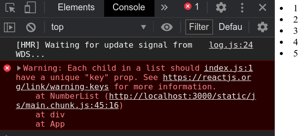

# React Intro

- [React Intro](#react-intro)
	- [Sources](#sources)
	- [Install & Run](#install--run)
		- [My template](#my-template)
	- [JSX](#jsx)
	- [Rendering Elements](#rendering-elements)
	- [Components](#components)
	- [Props](#props)
	- [State](#state)
		- [State updates may be asynchronous](#state-updates-may-be-asynchronous)
		- [State Updates are Merged](#state-updates-are-merged)
		- [The data flows down](#the-data-flows-down)
	- [Lifecycle](#lifecycle)
		- [Common lifecycle methods](#common-lifecycle-methods)
			- [`componentDidMount ()`](#componentdidmount-)
			- [`componentDidUpdate (prevProps, prevState, snapshot)`](#componentdidupdate-prevprops-prevstate-snapshot)
			- [`componentWillUnmount ()`](#componentwillunmount-)
			- [Clock example](#clock-example)
		- [Uncommon lifecycle methods](#uncommon-lifecycle-methods)
	- [Events](#events)
	- [Conditional Rendering](#conditional-rendering)
	- [Lists and Keys](#lists-and-keys)
	- [Forms](#forms)
		- [Controlled components](#controlled-components)
			- [`text`](#text)
			- [`textarea`](#textarea)
			- [`select`](#select)
		- [Multiple Inputs](#multiple-inputs)
		- [Uncontrolled components](#uncontrolled-components)
			- [`file`](#file)
	- [Lifting State Up](#lifting-state-up)
	- [Composition vs Inheritance](#composition-vs-inheritance)
		- [Containment](#containment)
		- [Specialization](#specialization)
	- [How to build your React apps](#how-to-build-your-react-apps)
		- [Break the UI into a component hierarchy](#break-the-ui-into-a-component-hierarchy)
		- [Build a static version in React](#build-a-static-version-in-react)
		- [Identify the minimal (but complete) representation of UI state](#identify-the-minimal-but-complete-representation-of-ui-state)
		- [Identify where your state should live](#identify-where-your-state-should-live)
		- [Add inverse data flow](#add-inverse-data-flow)
	- [Examples](#examples)
		- [Tic Tac Toe example](#tic-tac-toe-example)
		- [Filtered Table](#filtered-table)
			- [Classic](#classic)
			- [Hooks](#hooks)

***


## Sources

1. https://reactjs.org/docs/hello-world.html - docs
2. https://www.youtube.com/watch?v=xJZa2_aldDs - minin
3. https://github.com/facebook/react/issues/1342#issuecomment-39230939 - unique keys
4. https://stackoverflow.com/a/43892905/12166570 - unique keys

***


## Install & Run

https://create-react-app.dev/docs/adding-typescript/

To start the basic project, use the `create-react-app` template. Here's your typical project with **everything**:

```bash
npx create-react-app test --template typescript
npm i prop-types
npm i react-router-dom
npm i @types/react-router-dom

cd test
npm start
```

For the minimal configuration, only run `npx create-react-app test`

Usually our project will have the main `public/index.html` file with a single `div` element:

```html
<div id="root"></div>
```

This root container will contain our App that will be generated dynamically.

```js
// index.js
import React from 'react'
import ReactDOM from 'react-dom'
ReactDOM.render(<h1>Hello, world!</h1>, document.getElementById('root'))
```

***

### My template

```bash
npx create-react-app test --template redux-typescript 
cd test
npm i prop-types react-router-dom @types/react-router-dom 
```

`index.css`:

```css
@import-normalize; /* bring in normalize.css styles */
```

***


## JSX

**JSX is basically HTML elements with JS insertions inside.** From the JS perspective, JSX elements are **objects**.

```js
const jsx = <p>Hello, World!</p>
console.log(jsx)
ReactDOM.render(jsx, document.getElementById('root'))
```


***

Put any valid JS expression inside the **curly braces `{}`** in JSX.

```js
// index.js
import React from 'react'
import ReactDOM from 'react-dom'
import './index.css'

function formatName(user) {
	return user.firstName + ' ' + user.lastName
}

const user = {
	firstName: 'Harper',
	lastName: 'Perez'
}

const element = <h1>Hello, {formatName(user)}!</h1>

ReactDOM.render(element, document.getElementById('root'))
```

***

JSX elements are objects, we can use them in JS any way we want: in conditions, loops, functions etc. 

```js
function format(jsx) {
	return <h1>{jsx}</h1>
}

const jsx = <span>Hello, World!</span>

ReactDOM.render(format(jsx), document.getElementById('root'))
```

These two examples are identical and eventually turn into the same object:

```js
// This
const element = <h1 className="greeting">Hello, world!</h1>
// is the same as this
const element = React.createElement(
	'h1',
	{ className: 'greeting' },
	'Hello, world!'
)

// and are both eventually turn into this (simplified) object
const element = {
  type: 'h1',
  props: {
    className: 'greeting',
    children: 'Hello, world!'
  }
}
```

***

JSX elements can have child elements the same way as in HTML. If they don't - they can be **self-enclosing** (as in XML).

```js
const container = (
	<div>
		<input type="text" />
	</div>
)
```

***

To pass **attributes** or **props**, we use either **double quotes** for string literals (as we do in HTML) ...

```js
const element = <div tabIndex="0"></div>
```

... or **curly braces** for JS expressions.

```js
function zero(){
	return 0
}
const element = <div tabIndex={zero()}></div>
```

**Don't** put double quotes if you use curly braces!

***

We can use `...` operator to parse object into props:

```js
function App() {
  const props = {firstName: 'Ben', lastName: 'Hector'}
	return <Greeting {...props} />
	// return <Greeting firstName="Ben" lastName="Hector" />
}
```

Partial parsing also works as expected.

```js
function Button (props) {
	const { kind, ...other } = props
	const className = kind === 'primary' ? 'PrimaryButton' : 'SecondaryButton'
	return <button className={className} {...other} />
}

function App() {
	return (
		<div>
			<Button kind="primary" onClick={() => console.log('clicked!')}>
				Hello World!
			</Button>
		</div>
	)
}
```

***

Content between opening and enclosing tags is passed as a special `props.children`. 

```js
// This
<Button 
	kind="primary" 
	onClick={() => console.log('clicked!')}>
		Hello World!
</Button>

// ... is the same as this
<Button
	kind="primary"
	onClick={() => console.log('clicked!')}
	children={'Hello World!'} />
```

***

A React component can also return an array of elements

```js
// No need to wrap list items in an extra element!
return [
	// Don't forget the keys :)
	<li key="A">First item</li>,
	<li key="B">Second item</li>,
	<li key="C">Third item</li>,
]
```

***

**Functions as Children** 

You can pass a function as a child to an element (remember - it will be passed as the `children` prop). You can generate lists of messages this way:

```js
function Repeat(props) {
	const items = []
	for (let i = 0; i < props.numTimes; i++) {
		items.push(props.children(i))
	}
	return <div>{items}</div>
}

function ListOfThings(props) {
	return (
		<Repeat numTimes={props.numTimes}>
			{(index) => <div key={index}>This is item {index} in the list</div>}
		</Repeat>
	)
}

function App() {
	return (
		<div>
			<ListOfThings numTimes="20" />
		</div>
	)
}
```

Here we call the passed function 20 times and gather its output into an array. Then we render this array of `div`s. 

***

**JSX Prevents Injection Attacks!** 

It is safe to embed user input in JSX because `React DOM` **escapes** any values embedded in JSX before rendering them. Everything is converted to **strings** before being rendered.

```js
const title = response.potentiallyMaliciousInput
// This is safe:
const element = <h1>{title}</h1>
```

***


## Rendering Elements

Unlike browser DOM elements, React elements are plain objects, and are cheap to create. `React DOM` takes care of updating the DOM to match the React elements.

`ReactDOM.render (jsxElement, rootElement)` is responsible for rendering

```js
import React from 'react'
import ReactDOM from 'react-dom'

const container = (
	<div>
		<input type="text" />
	</div>
)

ReactDOM.render(container, document.getElementById('root'))
```

***

**REACT ELEMENTS ARE IMMUTABLE**

Once you create an element, you can’t change its children or attributes. An element is like a single frame in a movie: it represents the UI at a certain point in time, and you can't go back - you can only create a new frame.

Thus, the obvious way to update the UI is to create a **new element** and pass it to `ReactDOM.render()`

```js
function tick() {
	const element = (
		<div>
			<h2>It is {new Date().toLocaleTimeString()}.</h2>
		</div>
	)
	ReactDOM.render(element, document.getElementById('root'))
}

setInterval(tick, 1000)
```

But in practice we usually only call `ReactDOM.renader()` once and then we **update state** (see below).

***

**REACT ONLY UPDATES WHAT"S NECESSARY**

It compares the element and its children to the previous one, and only applies the DOM updates necessary to bring the DOM to the desired state.

You can make sure of it opening the previous example in the DevTools: even though we create an element describing the whole UI tree on every tick, only the text node whose contents have changed gets updated by React DOM.


Thus, **the React concept is thinking about how the UI should look at any given moment, rather than how to change it over time.**

***


## Components

Components let you split the UI into independent, reusable pieces, and think about each piece in isolation.

You can make components using `function` (recommended) or `class`.

Usually your components will live in separate files and: 

1. `import React from 'react'`
2. `export` your component (function or class)

**Always start component names with a capital letter** as components starting with lowercase letters are treated as the usual DOM tags. 

The two components below are equivalent from React's point of view:

```js
// Function component
function Welcome(props) {
	return <h1>Hello, {props.name}</h1>
}
ReactDOM.render(<Welcome name="max" />, document.getElementById('root'))


// Class component
class Welcome extends React.Component {
	render() {
		return <h1>Hello, {this.props.name}</h1>
	}
}
ReactDOM.render(<Welcome name='max' />, document.getElementById('root'))
```

**It's a good practice to split components into smaller components** (see examples below).
***


## Props

JSX attributes and children are passed to components **as a single object parameter** usually called "**props**" - similar to HTML-attributes.

```js

```

**Props are Read-Only**. All React components must act like **pure functions** with respect to their props. This means they don't have to change their `props` (parameters).

Typically, new React apps have a single `App` component at the very top, while all the other components are nested inside.

```js
const jack = {
	name: 'Jack',
	age: 20
}

const sara = {
	name: 'Sara',
	age: 23
}

function Welcome(props) {
	return <h1>Hello, {props.name}</h1>
}

function App() {
	return (
		<div>
			<Welcome name={sara.name} age={sara.age}/>	{/* JSX props */}
			<Welcome name="Jack" age="20" />	{/* String literals props */}
		</div>
	)
}

ReactDOM.render(<App />, document.getElementById('root'))
```

***


## State

Earlier we only called `ReactDOM.render()` to change the rendered output. The better way to do it is through changing the **`state`**.

Set state|Where and when|Notes
-|-|-
`this.state = {}`|`constructor`|We can only set the **state** directly in the `constructor`
`this.setState({})` or `this.setState((prevState, props) => ({}) )`|Anywhere **after** the component was mounted|The proper way of updating the component

***

### State updates may be asynchronous

React may batch multiple `setState()` calls into a single update for performance. 

You cannot rely on the previous state values calculating the next state:

```js
this.setState({
  counter: this.state.counter + this.props.increment,
})
```

To fix this, use **the second form** of `setState` with a **callback** receiving the previous state and the current props:

```js
this.setState((prevState, props) => ({
  counter: prevState.counter + props.increment
}))
```

***

### State Updates are Merged

When you call `setState()`, React **merges** the object you provide into the current state.

Example

```js
constructor(props) {
	super(props)
	this.state = {
		posts: [],
		comments: []
	}
}

componentDidMount() {
	// We only updated `comments` leaving `posts` intact - and they are NOT removed
	fetchComments().then(response => {
		this.setState({
			comments: response.comments
		})
	})
}
```

***

### The data flows down

The state is encapsulated in the component and may only affect components "below" the tree:

```js
<FormattedDate date={this.state.date} />
```

Also note that components may have **no state at all**.

***


## Lifecycle

Full info in the [docs](https://reactjs.org/docs/react-component.html#the-component-lifecycle)

Typical lifecycle: 


More complex lifecycle: 


There are special **lifecycle methods** in the component class for handling "**mounting**" (when the component is rendered in DOM) and "**unmounting**" (when the component is cleared).

***

### Common lifecycle methods

#### `componentDidMount ()`

Runs **once** after the component has been rendered to the DOM for the first time. 

Fetch data and set subscriptions here.

If you didn't set state in the `constructor`, you can do it here (though you should only do it if there's no other way - e.g. tooltips and other elements when you need to measure the position of the rendered element). This will call the second `render` but **the UI will only update once**! This is intended for user not to see double rendering.

***

#### `componentDidUpdate (prevProps, prevState, snapshot)`

https://reactjs.org/docs/react-component.html#componentdidupdate

Runs after the component was re-rendered. 

Example of typical usage: 

```js
componentDidUpdate(prevProps) {
 if (this.props.userName !== prevProps.userName) {
   this.fetchData(this.props.userName);
 }
}
```

Here we compared the current props to the previous props to check if we need to make new fetching.

***

#### `componentWillUnmount ()`

Runs before the component is destroyed (e.g. before rendering the updated state).

You **cannot** update state here as this component will never be re-rendered.

Common cleanup activities: 

- clearing timers
- cancelling network requests and subscriptions set in `componentDidMount ()`
- clearing any caches in storage

```js
componentWillUnmount() {
 window.removeEventListener('resize', this.resizeListener)
}
```

***

#### Clock example

```js
import React from 'react'
import ReactDOM from 'react-dom'

class Clock extends React.Component {
	constructor(props) {
		console.log('comstructor')
		super(props)
		// Set initial state (the first timestamp that will be displayed)
		this.state = { date: new Date() }
	}

	// Called one time after the first `render()` call
	componentDidMount() {
		console.log('didMount')
		this.timerId = setInterval(() => this.tick(), 1000)
	}

	// In our example this will never be called (because our element never gets removed from DOM), but it's it's a good practice to clear resources when we don't need them anymore
	componentWillUnmount() {
		console.log('willMount')
		clearInterval(this.timerId)
	}

	// This method will be called each time state is updated to re-render changes
	render() {
		console.log('render')
		return (
			<div>
				<h2>It is {this.state.date.toLocaleTimeString()}.</h2>
			</div>
		)
	}

	tick() {
		console.log('tick')
		// Update state
		this.setState({ date: new Date() })
	}
}

ReactDOM.render(<Clock />, document.getElementById('root'))
```

***

### Uncommon lifecycle methods

These methods are rarely used. Most of the time you won't need them. They are here only for reference, you don't need to learn them.

- `shouldComponentUpdate (nextProp, nextState)` - invoked before rendering when new props or state are being received. Defaults to `true`. 
- `componentDidCatch (error, info)` - invoked after an error has been thrown by a descendant component. Can be used for logging errors.
- `static getDerivedStateFromError (error)` - similar to the one above but runs during the `render` phase, so side-effects are not permitted. **Can be used for fallback rendering**.
- `getSnapshotBeforeUpdate (prevProps, prevState)` - invoked right before the most recently rendered output is committed to the DOM. It enables your component to capture some information from the DOM (e.g. scroll position) before it is potentially changed. Any value returned by this method **will be passed as a parameter** to `componentDidUpdate ()`. Might be used in chats to handle scroll position in a special way.
- `getDerivedStateFromProps ()` - rarely used

```js
componentDidCatch(error, info) {
	// Example "componentStack":
	//   in ComponentThatThrows (created by App)
	//   in ErrorBoundary (created by App)
	//   in div (created by App)
	//   in App
	logComponentStackToMyService(info.componentStack);
}

static getDerivedStateFromError(error) {
	// Update state so the next render will show the fallback UI.
	return { hasError: true }
}

render() {
	if (this.state.hasError) {
		// You can render any custom fallback UI
		return <h1>Something went wrong.</h1>
	}

	return this.props.children
}
```

***


## Events

Events are names using **camelCase**.

Handlers for the component are usually place inside of it.

When using React, you generally don’t need to to add listeners to a DOM element after it is created. Instead, just provide a listener when the element is initially rendered.

Don't forget to bind `this` for event handlers if they use regular function. Or just use arrow functions instead.

Example: on/off button

```js
class Toggle extends React.Component {
	constructor(props) {
		super(props)
		this.state = { isToggleOn: true }

		// This binding is necessary to make `this` work in the callback. Or just use arrow functions instead
		this.handleClick = this.handleClick.bind(this)
	}

	handleClick() {
		this.setState((state) => ({
			isToggleOn: !state.isToggleOn
		}))
	}

	render() {
		return (
			<button onClick={this.handleClick}>
				{this.state.isToggleOn ? 'ON' : 'OFF'}
			</button>
		)
	}
}

ReactDOM.render(<Toggle />, document.getElementById('root'))
```

To **pass arguments to event handlers**, use any of the 2 methods:

```js
<button onClick={(e) => this.deleteRow(id, e)}>Delete Row</button>
<button onClick={this.deleteRow.bind(this, id)}>Delete Row</button>
```

In both cases `e` will be passed as the last argument (in the second example - automatically).

***


## Conditional Rendering

Often we have to render components with different input parameters depending os some conditions. The easier way to do it is with **ternary operator**. But you can also use simple `if`.

Example: login/logout button and message

```js
import React from 'react'
import ReactDOM from 'react-dom'

function App() {
	return (
		<div>
			<LoginControl />
		</div>
	)
}

function UserGreeting() {
	return <h2>Welcome back!</h2>
}

function GuestGreeting() {
	return <h2>Please sign in</h2>
}

function Greeting(props) {
	if (props.isLoggedIn) {
		return <UserGreeting />
	}
	return <GuestGreeting />
}

function Button(props) {
	return <button onClick={props.onClick}>{props.textContent}</button>
}

class LoginControl extends React.Component {
	state = { isLoggedIn: false }
	
	handleLogIn = () => {
		this.setState({ isLoggedIn: true })
	}

	handleLogOut = () => {
		this.setState({ isLoggedIn: false })
	}

	render() {
		const button = this.state.isLoggedIn ? (
			<Button onClick={this.handleLogOut} textContent="Logout" />
		) : (
			<Button onClick={this.handleLogIn} textContent="Login" />
		)
		return (
			<div>
				<Greeting isLoggedIn={this.state.isLoggedIn} />
				{button}
			</div>
		)
	}
}

ReactDOM.render(<App />, document.getElementById('root'))
```

***

To **prevent component from rendering** when it was called by another component, set a condition and `return null`:

```js
function WarningBanner(props) {
  if (!props.warn) {
    return null
  }

	return <div>Warning<div>
}

// ... later when we call it:
<WarningBanner warn={this.state.showWarning} />
```

***


## Lists and Keys

List:

```js
function App() {
	return (
		<div>
			<NumberList numbers={[1, 2, 3, 4, 5]} />
		</div>
	)
}

function NumberList(props) {
	return props.numbers.map((number) => <li>{number}</li>)
}
```



The one thing missing here is **unique keys** for every element of the list. 

***

Keys are **unique identifiers** that React uses to distinguish elements of the same kind between each other. 

If they are missing, React will work unoptimally - e.g. rerender all elements each time some of them changed (because it doesn't know what elements should be updated and what - should not).

Useful sources:

1. Why keys should be unique: https://reactjs.org/docs/reconciliation.html#recursing-on-children
2. Why you shouldn't use *indices* as keys and what you **ahould** use: https://robinpokorny.medium.com/index-as-a-key-is-an-anti-pattern-e0349aece318

Note: 

1. Don't use *indices* or *Math.random()* to generate keys. Use [nanoid](https://github.com/ai/nanoid/) or UUID.

```js
import React from 'react'
import ReactDOM from 'react-dom'
import { nanoid } from 'nanoid'

function App() {
	return (
		<div>
			<NumberList numbers={[1, 2, 3, 4, 5]} />
		</div>
	)
}

function NumberList(props) {
	return props.numbers.map((number) => {
		const key = nanoid()	// generated unique key
		console.log(key)
		return <li key={key}>{number}</li>
	})
}

ReactDOM.render(<App />, document.getElementById('root'))
```


2. Keys should only be unique among siblings - no need to make them unique globally.
3. Keys only make sense in the context of the surrounding array. There's no need to specify them inside the component returning a single element - you should instead specify them as props when you call that component:

BAD:

```js
function ListItem(props) {
  return (
    <li key={props.value.toString()}>
      {props.value}
    </li>
  )
}

<ListItem value={number} />
```

GOOD:

```js
function ListItem(props) {
  return (
    <li>{props.value}</li>
  )
}

<ListItem key={number.toString()} value={number} />
```

***


## Forms

Forms can be tricky in React. You might want to use [formik](https://formik.org) to handle them better.

### Controlled components

Only get updated explicitly with `setState()`. It literally means that unless we manually `onChange={setState()}` our component, its value will never change (even if user makes an input). So the value displayed always corresponds to the inner state.

Specifying `value` on a controlled component prevents the user from changing the input unless you desire so.

```js
ReactDOM.render(<input value={ku} />, document.getElementById('root'))
// This input is immutable
```

There are 2 ways to change the value of such a component:

1. Set `onChange` handler that will `setState()`
2. Set `value={null}` or `value={undefined}`

***

#### `text`

```js
import React from 'react'
import ReactDOM from 'react-dom'

function App() {
	return (
		<div>
			<NameForm />
		</div>
	)
}

class NameForm extends React.Component {
	constructor(props) {
		super(props)
		this.state = { value: '' }

		this.handleChange = this.handleChange.bind(this)
		this.handleSumbit = this.handleSumbit.bind(this)
	}

	// Without this, you won't be able to change the input value
	handleChange(e) {
		this.setState({ value: e.target.value })
	}

	handleSumbit(e) {
		console.log(this.state.value)
		e.target.elements.text.value = ''
		e.preventDefault()
	}

	render() {
		return (
			<form onSubmit={this.handleSumbit}>
				<label>
					Name:
					<input name="text" onChange={this.handleChange} />
				</label>
				<button type="submit">Submit</button>
			</form>
		)
	}
}

ReactDOM.render(<App />, document.getElementById('root'))
```

***

#### `textarea`

The `value` attribute stores the content. 

The example is the same as above with minor changes.

```js
// constructor...
this.state = { value: 'Write your essay here...' }
// render...
<textarea value={this.state.value} onChange={this.handleChange} />
```

***

#### `select`

The `value` attribute indicates the **selected** option. 

The example is the same as above with minor changes.

```js
// constructor...
this.state = { value: 'coconut' }
// render...
<select value={this.state.value} onChange={this.handleChange}>
	<option value="grapefruit">Grapefruit</option>
	<option value="lime">Lime</option>
	<option value="coconut">Coconut</option>
	<option value="mango">Mango</option>
</select>
```

***


### Multiple Inputs

Set the `name` property for inputs to handle them based on their `e.target.name`

```js
import React from 'react'
import ReactDOM from 'react-dom'

function App() {
	return (
		<div>
			<Reservation />
		</div>
	)
}

class Reservation extends React.Component {
	constructor(props) {
		super(props)
		this.state = { isGoing: true, numberOfGuests: 2 }

		this.handleInputChange = this.handleInputChange.bind(this)
	}

	handleInputChange(e) {
		const target = e.target
		let value
		if (target.type === 'checkbox') {
			value = target.checked
		} else if (target.type === 'number') {
			value = Number(target.value)
		}
		this.setState({
			[target.name]: value
		})
		console.log(this.state)
	}

	render() {
		return (
			<form>
				<label>
					Is going:
					<input
						name="isGoing"
						type="checkbox"
						checked={this.state.isGoing}
						onChange={this.handleInputChange}
					/>
				</label>
				<br />
				<label>
					Number of guests:
					<input
						name="numberOfGuests"
						type="number"
						value={this.state.numberOfGuests}
						onChange={this.handleInputChange}
					/>
				</label>
				<button type="submit">Submit</button>
			</form>
		)
	}
}

ReactDOM.render(<App />, document.getElementById('root'))
```

***


### Uncontrolled components

Sometimes it becomes annoying to use **controlled** components, because you need to write an event handler for every way your data can change and pipe all of the input state through a React component. In these situations you might want to use **uncontrolled** components.


#### `file`

`<input type="file" />` is always an **uncontrolled** component because its value can only be set by a user, and not programmatically.

You should use the `File API` to interact with the files. The following example shows how to create a *ref to the DOM node* to access file(s):

```js

```

***


## Lifting State Up

https://reactjs.org/docs/lifting-state-up.html

Often, several components need to reflect the same changing data. Lift the shared state up to their closest common ancestor.

In React, sharing state is accomplished by moving it up to the closest common ancestor of the components that need it. This is called “lifting state up”.

**Example**: the temperature calculator where two inputs share the same state.

For this, we remove the local state from the `TemperatureInput` and move it into the `Calculator`

The inputs stay in sync because their values are computed from the same state (of the parent `Calculator`).

```js
import React from 'react'
import ReactDOM from 'react-dom'

const scaleNames = {
	c: 'Celsius',
	f: 'Fahrenheit'
}

function BoilingVerdict(props) {
	if (props.celsius >= 100) {
		return <p>The water would boil.</p>
	}
	return <p>The water would not boil.</p>
}

function toCelsius(fahrenheit) {
	return ((fahrenheit - 32) * 5) / 9
}

function toFahrenheit(celsius) {
	return (celsius * 9) / 5 + 32
}

function tryConvert(temperature, convertFn) {
	const input = parseFloat(temperature)
	if (isNaN(input)) {
		return ''
	}
	const output = Math.round(convertFn(input) * 1000) / 1000
	return output.toString()
}

class TemperatureInput extends React.Component {
	constructor(props) {
		super(props)
		this.state = { temperature: props.temperature }
		this.handleChange = this.handleChange.bind(this)
	}

	handleChange(e) {
		this.props.onTemperatureChange(e.target.value)
	}

	render() {
		const temperature = this.props.temperature
		return (
			<fieldset>
				<legend>Enter temperature in {scaleNames[this.props.scale]}</legend>
				<input value={temperature} onChange={this.handleChange} />
			</fieldset>
		)
	}
}

class Calculator extends React.Component {
	constructor(props) {
		super(props)
		this.state = { temperature: '', scale: 'c' }
		this.handleCelsuisChange = this.handleCelsuisChange.bind(this)
		this.handleFahrenheitChange = this.handleFahrenheitChange.bind(this)
	}

	handleCelsuisChange(temperature) {
		this.setState({ scale: 'c', temperature })
	}

	handleFahrenheitChange(temperature) {
		this.setState({ scale: 'f', temperature })
	}

	render() {
		const celsius =
			this.state.scale === 'c'
				? this.state.temperature
				: tryConvert(this.state.temperature, toCelsius)
		const fahrenheit =
			this.state.scale === 'f'
				? this.state.temperature
				: tryConvert(this.state.temperature, toFahrenheit)
		return (
			<div>
				<TemperatureInput
					scale="c"
					temperature={celsius}
					onTemperatureChange={this.handleCelsuisChange}
				/>
				<TemperatureInput
					scale="f"
					temperature={fahrenheit}
					onTemperatureChange={this.handleFahrenheitChange}
				/>
				<BoilingVerdict celsius={celsius} />
			</div>
		)
	}
}

function App() {
	return (
		<div>
			<Calculator />
		</div>
	)
}

ReactDOM.render(<App />, document.getElementById('root'))
```

***


## Composition vs Inheritance

Composition is good, it helps reusing code between components. 

Inheritance is bad, it makes code more complex, avoid using it.

If you want to reuse non-UI functionality between components, extract it into a separate JS module. The components may import it and use that function, object, or a class, without extending it.

***

### Containment

Some components don’t know their children ahead of time (e.g. sidebars and chat containers). The good practice is to pass child elements through the `children` property directly into their output.

```js
function FancyBorder(props) {
  return (
    <div className={'FancyBorder FancyBorder-' + props.color}>
      {props.children}
    </div>
  )
}
```

This lets other components pass arbitrary children to them by nesting the JSX (similar to the Shadow DOM slots):

```js
function WelcomeDialog() {
  return (
    <FancyBorder color="blue">
      <h1 className="Dialog-title">
        Welcome
      </h1>
      <p className="Dialog-message">
        Thank you for visiting our spacecraft!
      </p>
    </FancyBorder>
  )
}
```

Anything inside the `<FancyBorder>` JSX tag gets passed into the `FancyBorder` component as a `children` prop. Note how the child elements got inside the `div` with classes:


You can also use your custom props in the same matter:

```js
function SplitPane(props) {
	return (
		<div className="SplitPane">
			<div className="SplitPane-left">{props.left}</div>
			<div className="SplitPane-right">{props.right}</div>
		</div>
	)
}

function App() {
	return (
		<div>
			<SplitPane left={<Contacts />} right={<Chat />} />
		</div>
	)
}
```

***

### Specialization

The usual practice is to use some components as special cases of other (generic) components.

```js
function Dialog(props) {
  return (
    <FancyBorder color="blue">
      <h1 className="Dialog-title">
        {props.title}
      </h1>
      <p className="Dialog-message">
        {props.message}
      </p>
    </FancyBorder>
  )
}

function WelcomeDialog() {
  return (
    <Dialog
      title="Welcome"
      message="Thank you for visiting our spacecraft!" />
  )
}
```

***


## How to build your React apps

https://reactjs.org/docs/thinking-in-react.html

Image you received this data from some API:

```json
[
  {category: "Sporting Goods", price: "$49.99", stocked: true, name: "Football"},
  {category: "Sporting Goods", price: "$9.99", stocked: true, name: "Baseball"},
  {category: "Sporting Goods", price: "$29.99", stocked: false, name: "Basketball"},
  {category: "Electronics", price: "$99.99", stocked: true, name: "iPod Touch"},
  {category: "Electronics", price: "$399.99", stocked: false, name: "iPhone 5"},
  {category: "Electronics", price: "$199.99", stocked: true, name: "Nexus 7"}
];
```

And you want to build such a table from it:


***

### Break the UI into a component hierarchy


1. `FilterableProductTable` (orange): contains the entirety of the example
2. `SearchBar` (blue): receives all user input
3. `ProductTable` (green): displays and filters the data collection based on user input
4. `ProductCategoryRow` (turquoise): displays a heading for each category
5. `ProductRow` (red): displays a row for each product
6. (optional) `ProductTableHeader` - if the table header becomes too complex (e.g. involves sorting).

Your top component (1) will take your data model as a prop.

***

### Build a static version in React

First, build a version that renders the UI but has no interactivity. 

Build components that **reuse** other components. 

Use **props** to pass data from parents to children. 

**DON'T** use `state` at this point! It represents the data change over time, we don't need it yet.

You can build **top-down** or **bottom-up**. In simpler examples, it’s usually easier to go top-down, and on larger projects, it’s easier to go bottom-up and write tests as you build.

At the end of this step, you’ll have a **library of reusable components** that render your data model. The components will only have `render()` methods since this is a static version of your app.

***

### Identify the minimal (but complete) representation of UI state

Now it's time for **states** - they represent **inner changes** in the underlying model.

Follow the **DRY** principle here. E.g. for a TODO app, keep an array of tasks and **don't** keep a separate state variable for the count! Instead, take the length of the task array when you render it.

To decide what is **state**, answer these questions:

1. Is it passed in from a parent via props?
2. Does it remain unchanged over time?
3. Can you compute it based on any other state or props in your component?

If the answer is **"no"** for any of these questions - it's probably **not** a state. 

Of all pieces of data in our app:

1. The original list of products - passed as props - **not a state**
2. The search text the user has entered - changes over time and can't be computed - **state** 
3. The value of the checkbox - **state**
4. The filtered list of products - can be computed from 1,2,3 - **not a state**

***

### Identify where your state should live

We need to identify which component mutates, or **owns**, this state.

Figuring out **what component should own what state** might be the most challenging part. To do it:

1. Identify every component that renders something based on that state.
2. Find a common owner component (kinda `closest()`) for all of them.
3. Either that **common owner component** or another component even higher in the hierarchy should own the state.
4. If you can't find the component where it'll make sense to store the **state**, you can create a new one - solely for the purpose of holding the state. Place it one level higher that the common owner component.

The **strategy** for our application:

1. `ProductTable` updates your product list based on the **state**. 
2. `SearchBar` displays the search text and checked state.
3. The common owner component is `FilterableProductTable` - here will live our **state**.

Set the initial state in the `constructor` and then pass it to the elements that need it, as **props** in `render()`

```js
// constructor...
// Set the initial state
this.state = {filterText: '', inStockOnly: false}

// render...
<SearchBar filterText={this.state.filterText} isStockOnly={this.state.isStockOnly} />
<ProductTable filterText={this.state.filterText} isStockOnly={this.state.isStockOnly} />
```

***

### Add inverse data flow

So far, our app renders correctly as a function of props and state flowing down the hierarchy. Now we need to support the data flowing the other way: deep nested components should update the **state** at the top. 

Since **components should only update their own state**, we'll pass callbacks with `setState()` from the top `FilterableProductTable` element to the nested `SearchBar` as **props**. Set this callback as its `onChange` handler. 

See [Filtered Table](#filtered-table) example for all these notes in practice.

***


## Examples

### Tic Tac Toe example

https://reactjs.org/tutorial/tutorial.html#setup-for-the-tutorial

We begin with:

```bash
npx create-react-app Tic Tac Toe
cd 'Tic Tac Toe'
npm start
```

Project structure:

```
node_modules
public
	index.html
src
	index.css
	index.js
```

**index.js**

```js
import React from 'react'
import ReactDOM from 'react-dom'
import './index.css'

class Square extends React.Component {
	render() {
		return <button className="square">{/* TODO */}</button>
	}
}

class Board extends React.Component {
	renderSquare(i) {
		return <Square />
	}

	render() {
		const status = 'Next player: X'

		return (
			<div>
				<div className="status">{status}</div>
				<div className="board-row">
					{this.renderSquare(0)}
					{this.renderSquare(1)}
					{this.renderSquare(2)}
				</div>
				<div className="board-row">
					{this.renderSquare(3)}
					{this.renderSquare(4)}
					{this.renderSquare(5)}
				</div>
				<div className="board-row">
					{this.renderSquare(6)}
					{this.renderSquare(7)}
					{this.renderSquare(8)}
				</div>
			</div>
		)
	}
}

class Game extends React.Component {
	render() {
		return (
			<div className="game">
				<div className="game-board">
					<Board />
				</div>
				<div className="game-info">
					<div>{/* status */}</div>
					<ol>{/* TODO */}</ol>
				</div>
			</div>
		)
	}
}

// ========================================

ReactDOM.render(<Game />, document.getElementById('root'))
```

**index.css**

```css
body {
	font: 14px 'Century Gothic', Futura, sans-serif;
	margin: 20px;
}

ol,
ul {
	padding-left: 30px;
}

.board-row:after {
	clear: both;
	content: '';
	display: table;
}

.status {
	margin-bottom: 10px;
}

.square {
	background: #fff;
	border: 1px solid #999;
	float: left;
	font-size: 24px;
	font-weight: bold;
	line-height: 34px;
	height: 34px;
	margin-right: -1px;
	margin-top: -1px;
	padding: 0;
	text-align: center;
	width: 34px;
}

.square:focus {
	outline: none;
}

.kbd-navigation .square:focus {
	background: #ddd;
}

.game {
	display: flex;
	flex-direction: row;
}

.game-info {
	margin-left: 20px;
}
```

***

### Filtered Table

#### Classic

```js

```

***

#### Hooks

```js

```

***