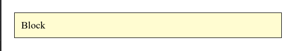
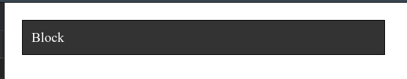
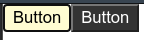

# React Context

- [React Context](#react-context)
	- [Sources](#sources)
	- [Intro](#intro)
		- [Why do we need it](#why-do-we-need-it)
		- [When we don't need it](#when-we-dont-need-it)
	- [API](#api)
		- [React.createContext](#reactcreatecontext)
		- [Context.Provider](#contextprovider)
		- [Class.contextType](#classcontexttype)
		- [Context.Consumer](#contextconsumer)
		- [Context.displayName](#contextdisplayname)
	- [Caveats](#caveats)
	- [Examples](#examples)
		- [Dynamic context](#dynamic-context)
		- [Updating context from a nested component](#updating-context-from-a-nested-component)
		- [Multiple contexts](#multiple-contexts)

***


## Sources

1. https://tproger.ru/translations/react-context-in-5-min/
2. https://reactjs.org/docs/context.html#before-you-use-context

***

## Intro

### Why do we need it

Sometimes we are forced to pass props from the top component down the component tree for the bottom one to use it. All the intermediate component might not need these props but are burdened with passing them down. And it can be hard to change or add something if needed.

Context lets us pass a value deep into the component tree without explicitly threading it through every component. Such "global" data can be: 

- the current authenticated user
- theme
- preferred language, etc.

***

### When we don't need it

Context is used when some data needs to be accessible by **many** components at different nesting levels. Apply it sparingly because it makes component reuse more difficult.

If we pass props all the way down to only be actually used at the bottom, we could use an alternative - pass the bottom component itself via props.  

Example:

```js
function Page(props) {
  const userLink = (
    <Link href={props.user.permalink}>
      <Avatar user={props.user} size={props.avatarSize} />
    </Link>
  )
  return <PageLayout userLink={userLink} />
}

// Now, we have:
<Page user={user} avatarSize={avatarSize} />
// ... which renders ...
<PageLayout userLink={...} />
// ... which renders ...
<NavigationBar userLink={...} />
// ... which renders ...
{props.userLink}
```

Here we'll use simple examples with context where you don't really need it - **but this is only for demonstrating purposes!**

***


## API

Further we'll use this `index.css` in the examples:

```css
body {
	margin: 0;
	padding: 0;
	box-sizing: border-box;
}

.light-block {
	background-color: #fffdd0;
	color: #000;
}

.dark-block {
	background-color: #333;
	color: #fff;
}

.block {
	margin: 20px;
	padding: 10px;
	border: 1px solid black;
	width: 400px;
}
```

***

### React.createContext

```js
const ThemeContext = React.createContext('optional default value')
```

Creates a Context object. When React renders a component that subscribed to this Context object, it will read the current context `value` from the closest matching Provider above it in the tree.

The defaultValue argument is **only** used when a component does not have a matching Provider above it in the tree.

***

### Context.Provider

```js
<MyContext.Provider value={'dark'}>
	<MyBlock />
</MyContext.Provider>
```

Subscribes descendents to context changes. 

All consumers (descendents that use `.contextType` or `useContext`) will re-render whenever the Provider’s `value` prop changes.

Features:

- Accepts a mandatory `value` prop that will be passed to the descendents of this Provider. 
- One Provider can be connected to many consumers. 
- Providers can be nested to override values deeper within the tree.
- It's better to wrap components with `Provider` at the lowest level you actually need. 

***

### Class.contextType

Used with **class** components.

```js
import React, { useState, useContext } from 'react'
import ReactDOM from 'react-dom'
import './index.css'

const MyContext = React.createContext()

class MyBlock extends React.Component {
	// pass the Context object to your class component
	static contextType = MyContext

	render() {
		return <div className={`${this.context}-block block`}>Div</div>
	}
}

// Or the classic way:
// MyBlock.contextType = MyContext

function App() {
	return (
		<MyContext.Provider value={'light'}>
			<MyBlock />
		</MyContext.Provider>
	)
}

ReactDOM.render(<App />, document.getElementById('root'))
```



One of the ways to consume the nearest current value of the Context object using `this.context` later in an instance. 

You can **only subscribe to a single context** using this API.

***

### Context.Consumer

Used with **function** components.

```js
import React, { useState, useContext } from 'react'
import ReactDOM from 'react-dom'
import './index.css'

const MyContext = React.createContext()

function MyBlock() {
	return (
		<MyContext.Consumer>
			{(value) => {
				return <div className={`${value}-block block`}>Div</div>
			}}
		</MyContext.Consumer>
	)
}

function App() {
	return (
		<MyContext.Provider value={'dark'}>
			<MyBlock />
		</MyContext.Provider>
	)
}

ReactDOM.render(<App />, document.getElementById('root'))
```



Requires a **function as a child**. The function receives the current context `value` and returns a React node. 

The `value` argument is equal to the `value` prop of the closest Provider above in the tree.

***

### Context.displayName

Only used for debugging - the provided name will be displayed in React DevTools. 

```js
const MyContext = React.createContext()
MyContext.displayName = 'MyDisplayName'
```

***


## Caveats

To avoid unintentional re-render, you can lift-up the Provider's `value` to **state**.

BAD

```js
const MyContext = React.createContext(null)

function App() {
	const [state, setSt] = useState({ something: 'something' })

	return (
		// Will re-render all consumers every time the Provider re-renders because a new object is always created for `value`
		<MyContext.Provider value={{ something: 'something' }}>
			<Toolbar />
		</MyContext.Provider>
	)
}
```

GOOD

```js
const MyContext = React.createContext(null)

function App() {
	const [state, setSt] = useState({ something: 'something' })

	return (
		<MyContext.Provider value={state}>
			<Toolbar />
		</MyContext.Provider>
	)
}
```

***


## Examples

### Dynamic context

A more complex example with dynamic values for the theme.

*index.js*

```js
import React, { useState } from 'react'
import ReactDOM from 'react-dom'
import { ThemeContext, themes } from './themeContext'
import ThemedButton from './ThemedButton'
import './index.css'

function Toolbar(props) {
	return <ThemedButton onClick={props.changeTheme} />
}

function App() {
	const [theme, setTheme] = useState(themes.light)

	function toggleTheme() {
		setTheme(theme === themes.light ? themes.dark : themes.light)
	}

	return (
		<div>
			<ThemeContext.Provider value={theme}>
				<Toolbar changeTheme={toggleTheme} />
			</ThemeContext.Provider>
			<ThemedButton />
		</div>
	)
}

ReactDOM.render(<App />, document.getElementById('root'))
```

*themeContext.js*

```js
import React from 'react'

export const themes = {
	light: {
		foreground: '#000',
		background: '#fffdd0'
	},
	dark: {
		foreground: '#fff',
		background: '#333'
	}
}

export const ThemeContext = React.createContext(themes.dark)
```

*ThemedButton.js*

```js
import React, { useContext } from 'react'
import { ThemeContext } from './themeContext'

function ThemedButton(props) {
	const theme = useContext(ThemeContext)

	return (
		<button
			{...props}
			style={{ backgroundColor: theme.background, color: theme.foreground }}
		>
			Button
		</button>
	)
}

export default ThemedButton
```

The 1st button uses the theme from state.

The 2nd button doesn't have a Provider and relies on the default value from the Context.



***

### Updating context from a nested component

It is often necessary to update the context from a deeply nested component. You can pass a function down through the context to allow consumers to update the context.

*index.js*

```js
import React, { useState } from 'react'
import ReactDOM from 'react-dom'
import { ThemeContext, themes } from './themeContext'
import ThemedButton from './ThemedButton'
import './index.css'
import ThemeTogglerButton from './ThemeTogglerButton'

function Toolbar(props) {
	return <ThemedButton onClick={props.changeTheme} />
}

function App() {
	// As state also contains the updater function, it will be passed down into the context Provider
	const [state, setTheme] = useState({ theme: themes.light, toggleTheme })

	function toggleTheme() {
		if (state.theme === themes.light) {
			console.log('light')
			console.log(themes.dark)
			setTheme({
				theme: { foreground: '#fff', background: '#333' },
				toggleTheme
			})
			console.log(state)
		} else {
			console.log('dark')
			setTheme({ theme: themes.light, toggleTheme })
		}
		// setTheme(
		// 	state.theme === themes.light
		// 		? { theme: themes.dark, toggleTheme }
		// 		: { theme: themes.light, toggleTheme }
		// )
	}

	return (
		<div>
			<ThemeContext.Provider value={state}>
				{/* <Toolbar changeTheme={toggleTheme} /> */}
				<ThemeTogglerButton />
			</ThemeContext.Provider>
		</div>
	)
}

ReactDOM.render(<App />, document.getElementById('root'))
```

*themeContext.js*

```js
import React from 'react'

export const themes = {
	light: {
		foreground: '#000',
		background: '#fffdd0'
	},
	dark: {
		foreground: '#fff',
		background: '#333'
	}
}

export const ThemeContext = React.createContext({
	theme: themes.dark,
	toggleTheme: () => {} // no default function
})
```

*ThemeTogglerButton.js*

```js
import React from 'react'
import { ThemeContext } from './themeContext'

function ThemeTogglerButton() {
	return (
		<ThemeContext.Consumer>
			{({ theme, toggleTheme }) => {
				// debugger
				return (
					<button
						onClick={toggleTheme}
						style={{ background: theme.background, color: theme.foreground }}
					>
						Toggle Theme
					</button>
				)
			}}
		</ThemeContext.Consumer>
	)
}

export default ThemeTogglerButton
```

***

### Multiple contexts

Double context = double Provider + double Consumer

```js
//...
const ThemeContext = React.createContext('light');
const UserContext = React.createContext({
  name: 'Guest',
})

// ...
<ThemeContext.Provider value={theme}>
	<UserContext.Provider value={signedInUser}>
		<Layout />
	</UserContext.Provider>
</ThemeContext.Provider>

//...
<ThemeContext.Consumer>
	{theme => (
		<UserContext.Consumer>
			{user => (
				<ProfilePage user={user} theme={theme} />
			)}
		</UserContext.Consumer>
	)}
</ThemeContext.Consumer>
```