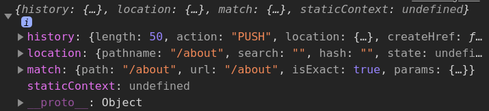

# React Advanced 

- [React Advanced](#react-advanced)
	- [Error Boundaries](#error-boundaries)
		- [Basics](#basics)
			- [Full Example](#full-example)
		- [Details](#details)
			- [Where to put error boundaries](#where-to-put-error-boundaries)
			- [Development vs Production](#development-vs-production)
			- [Why not just `try..catch`?](#why-not-just-trycatch)
			- [Event handlers](#event-handlers)
	- [Fragments](#fragments)
		- [Basics](#basics-1)
			- [Full Example](#full-example-1)
		- [Details](#details-1)
			- [Why don't just always return arrays of elements?](#why-dont-just-always-return-arrays-of-elements)
	- [Portals](#portals)
		- [Basics](#basics-2)
		- [Why do we need it?](#why-do-we-need-it)
		- [Example with modals](#example-with-modals)
	- [`prop-types`](#prop-types)
	- [Refs](#refs)
		- [Basics](#basics-3)
		- [Classic ref](#classic-ref)
		- [Callback ref](#callback-ref)
		- [`useRef`](#useref)
	- [Router, `react-router-dom`](#router-react-router-dom)
		- [Basics](#basics-4)
		- [Details](#details-2)
			- [Extra props](#extra-props)
			- [`<BrowserRouter>`](#browserrouter)
			- [`<Link>`](#link)
			- [`<NavLink>`](#navlink)
			- [`<Redirect>`](#redirect)
	- [Strict Mode](#strict-mode)
	- [Loader](#loader)
	- [Lazy loading](#lazy-loading)

***

## Error Boundaries

https://reactjs.org/docs/error-boundaries.html

### Basics

Error Boundaries are React components that catch JS errors anywhere in their child component tree, log those errors, and display a fallback UI instead of the component tree that crashed.

They work like `catch` block for components.

They do **not** catch errors for:

- Event handlers
- Async code
- Server-side rendering
- Errors in the error boundary itself

**Only class components** can be error boundaries. Most of the time you’ll want to declare an error boundary component once and use it throughout your application.

To become an **error boundary**, class should define any (or both) of these methods:

- `static getDerivedStateFromError (error)` - should return updated State (which will trigger re-render) - the best for serving a fallback UI
- `componentDidCatch (error, errInfo)` - log error info here; you can update State (to render a fallback UI) here as well

```js
class ErrorBoundary extends React.Component {
	constructor(props) {
		super(props)
		this.state = { hasError: false }
	}

	static getDerivedStateFromError(error) {
		// Update state so the next render will show the fallback UI.
		return { hasError: true }
	}

	componentDidCatch(error, errorInfo) {
		// You can also log the error to an error reporting service
		logErrorToMyService(error, errorInfo)
	}

	render() {
		if (this.state.hasError) {
			// You can render any custom fallback UI
			return <h1>Something went wrong.</h1>
		}

		return this.props.children
	}
}
```

Then use it as a wrapper:

```html
<ErrorBoundary>
  <MyWidget />
</ErrorBoundary>
```

***

#### Full Example

```js
import React, { useState } from 'react'
import ReactDOM from 'react-dom'

class ErrorBoundary extends React.Component {
	constructor(props) {
		super(props)
		this.state = { error: null, errorInfo: null }
	}

	componentDidCatch(error, errorInfo) {
		// Catch errors in any components below and re-render with error message
		this.setState({
			error: error,
			errorInfo: errorInfo
		})
		// You can also log error messages to an error reporting service here
	}

	render() {
		if (this.state.errorInfo) {
			// Error path
			return (
				<div>
					<h2>Something went wrong.</h2>
					<details style={{ whiteSpace: 'pre-wrap' }}>
						{this.state.error && this.state.error.toString()}
						<br />
						{this.state.errorInfo.componentStack}
					</details>
				</div>
			)
		}
		// Normally, just render children
		return this.props.children
	}
}

function BuggyCounter(props) {
	const [counter, setCounter] = useState(0)

	function handleClick() {
		setCounter(() => counter + 1)
	}

	if (counter === 3) {
		// Simulate a JS error
		throw new Error('I crashed!')
	}
	return <h1 onClick={handleClick}>{counter}</h1>
}

function App() {
	return (
		<div>
			<p>
				<b>
					This is an example of error boundaries in React 16.
					<br />
					<br />
					Click on the numbers to increase the counters.
					<br />
					The counter is programmed to throw when it reaches 3. This simulates a
					JavaScript error in a component.
				</b>
			</p>
			<hr />
			<ErrorBoundary>
				<p>
					These two counters are inside the same error boundary. If one crashes,
					the error boundary will replace both of them.
				</p>
				<BuggyCounter />
				<BuggyCounter />
			</ErrorBoundary>
			<hr />
			<p>
				These two counters are each inside of their own error boundary. So if
				one crashes, the other is not affected.
			</p>
			<ErrorBoundary>
				<BuggyCounter />
			</ErrorBoundary>
			<ErrorBoundary>
				<BuggyCounter />
			</ErrorBoundary>
		</div>
	)
}

ReactDOM.render(<App />, document.getElementById('root'))
```

***

### Details

#### Where to put error boundaries

Anywhere you want. It might be:

- Around the **top-level** components to display a "Something went wrong" message. 
- Around **low-level** components to protect them from crashing the rest of the app. 

The best practice is to wrap all essential components in their separate error boundaries, plus wrap the top-level component in the last hope boundary. 

Uncaught errors will crash the app. 

***

#### Development vs Production

You might not see how Error Boundaries work in **development** because of the extra error messages - but they do work in **production**.

To switch to **production**, follow the instructions of `create-react-app`:


```bash
npm run build
# sudo npm i -g serve 
serve -s build
```

***

#### Why not just `try..catch`?

`try..catch` only works for **imperative** *("how")* code while React components are **declarative** *("what")*.

It means, you **cannot** do this, it **won't** work: 

```js
function App() {
	try {
		return (
			<BuggyCounter />
		)
	} catch (err) {
		console.log(err)
	}
}
```

Instead, you'll have to insert `try..catch` in **every** method of every component - not an elegant solution. 

*** 

#### Event handlers

Event handlers don't happen during rendering. If they throw, React still knows what to display on the screen.

Use regular `try..catch` if you need to catch an error inside event handler:

```js
handleClick() {
	try {
		// Do something that could throw
	} catch (error) {
		this.setState({ error })
	}
}
```

***


## Fragments

https://reactjs.org/docs/fragments.html

### Basics

A common pattern in React is for a component to return **multiple elements**. 

Fragments **group a list of children** without adding extra nodes to the DOM.

E.g. this can be useful to return a list of `<li>` or `<td>`:

```js
// Classic syntax
<React.Fragment>
	<li></li>
	<li></li>
</React.Fragment>

// New simplified syntax
<>
	<li></li>
	<li></li>
</>
```

Though, in most cases you can just return array of elements.

***

#### Full Example

```js
import React from 'react'
import ReactDOM from 'react-dom'
import { nanoid } from 'nanoid'

function Table() {
	return (
		<table>
			<tbody>
				<tr>
					<Column />
				</tr>
				<tr>
					<Column />
				</tr>
			</tbody>
		</table>
	)
}

function Column() {
	/* Any of the 3 below will produce the same result */

	/* 1) Return an array of elements */

	// return [
	// 	<td key={nanoid()}>1</td>,
	// 	<td key={nanoid()}>2</td>,
	// 	<td key={nanoid()}>3</td>
	// ]

	/* 2) Return Classic Fragments */

	// return (
	// 	<React.Fragment>
	// 		<td key={nanoid()}>1</td>
	// 		<td key={nanoid()}>2</td>
	//		<td key={nanoid()}>3</td>
	// 	</React.Fragment>
	// )

	/* 3) Return Simplified Syntax Fragments */
	
	return (
		<>
			<td key={nanoid()}>1</td>
			<td key={nanoid()}>2</td>
			<td key={nanoid()}>3</td>
		</>
	)
}

function App() {
	return (
		<div>
			<Table />
		</div>
	)
}

ReactDOM.render(<App />, document.getElementById('root'))
```

***

### Details

#### Why don't just always return arrays of elements?

Because there can be cases when we can't. 

Classic syntax `React.Friagment` can have a `key` prop. This allows dynamically rendering lists of elements that require `key` but shouldn't be wrapped in extra elements:

```js
import React from 'react'
import ReactDOM from 'react-dom'
import { nanoid } from 'nanoid'

function Glossary(props) {
	return (
		<dl>
			{props.items.map((item) => (
				// Without `key`, React will fire a warning
				<React.Fragment key={item.id}>
					<dt>{item.term}</dt>
					<dd>{item.description}</dd>
				</React.Fragment>
			))}
		</dl>
	)
}

const glossary = [
	{
		id: nanoid(),
		term: 'WHO',
		description:
			'The World Health Organization is a specialized agency of the United Nations responsible for international public health.'
	},
	{
		id: nanoid(),
		term: 'ISS',
		description:
			'The International Space Station is a modular space station in low Earth orbit.'
	}
]

function App() {
	return (
		<div>
			<Glossary items={glossary} />
		</div>
	)
}

ReactDOM.render(<App />, document.getElementById('root'))
```

Here we cannot replace Fragment with array, as usual. We won't have an item to insert `key` into - so we'll get a warning:

```js
// BAD
function Glossary(props) {
	return (
		<dl>
			{props.items.map((item) =>
				[
					<dt>{item.term}</dt>, 
					<dd>{item.description}</dd>
				]
			)}
		</dl>
	)
}
```

***


## Portals

https://reactjs.org/docs/portals.html

### Basics

Portals allow to render children into a DOM node that exists **outside** the DOM hierarchy of the parent component.

Basically this means **outside of `root`** in HTML hierarchy but still **inside** the React hierarchy with the correct event propagation. 

Portals only affect the DOM structure and don't affect React in any way.

The most common use cases are when the child components need to visually break out of the parent container:

- Modal dialog boxes
- Tooltips
- Hovercards
- Loaders

```js
// Inside component
return ReactDOM.createPortal (child, container)
// Instead of the usual 
// return child
```

- `child` - a **renderable** React node (element | fragment | string).
- `container` - a DOM element

***

### Why do we need it?

Imagine you want to create a modal appearing after a button click.

You place it inside its parent React component which creates this structure:


But there's a problem: as our modal resides **inside its parent HTML element**, it inherits some CSS properties (`height` and `width`) from it which can force the modal to be cropped and not be shown properly. 


We could tweak it with CSS (`overflow:hidden` and `z-index`). But here we'll use Portals to place our modal **outside** of `root` to create this structure:


This way our modal will render referring to the `document`, not our component - just what we probably want:


***

### Example with modals

```js
import React, { useState } from 'react'
import ReactDOM from 'react-dom'
import './index.css'

function Modal({ message, isOpen, onClose }) {
	if (!isOpen) return null
	return (
		<div className="modal">
			<h2>{message}</h2>
			<button className="close" onClick={onClose}>
				Close
			</button>
		</div>
	)
}

function PortalModal({ message, isOpen, onClose }) {
	if (!isOpen) return null
	return ReactDOM.createPortal(
		<div className="modal">
			<h2>{message}</h2>
			<button className="close" onClick={onClose}>
				Close
			</button>
		</div>,
		document.body
	)
}

function App() {
	const [open, setOpen] = useState(false)
	const [openPortal, setOpenPortal] = useState(false)

	return (
		<div className="container">
			<div className="button-container">
				<button className="button" onClick={() => setOpen(true)}>
					Open Modal
				</button>
				<button className="button" onClick={() => setOpenPortal(true)}>
					Open Portal Modal
				</button>
			</div>
			<div>
				<Modal
					message="Modal Hello World"
					isOpen={open}
					onClose={() => setOpen(false)}
				/>
				<PortalModal
					message="Portal Modal Hello World"
					isOpen={openPortal}
					onClose={() => setOpenPortal(false)}
				/>
			</div>
		</div>
	)
}

ReactDOM.render(<App />, document.getElementById('root'))
```

There's no visible difference between a regular modal and a Portal modal until we connect `css`.

```css
body {
	margin: 0;
	padding: 0;
	box-sizing: border-box;
}

.button {
	color: #fff;
	background-color: #000;
	cursor: pointer;
	border-radius: 20px/50px;
	padding: 10px;
}

.button:hover {
	opacity: 0.7;
}

.button-container {
	margin: 25px;
}

.container {
	background-color: #ddd5cc;
	position: absolute;
	left: 50%;
	top: 50%;
	transform: translate(-50%, -50%);
}

.modal {
	position: relative;
	background-color: #fff;
	border: 3px solid black;
	border-radius: 5px;
	margin: 70px auto;
	padding: 20px;
	width: 30%;
}
```

***


## `prop-types`

1. https://blog.logrocket.com/validating-react-component-props-with-prop-types-ef14b29963fc/ - tutorial
2. https://reactjs.org/docs/typechecking-with-proptypes.html - docs

This optional lib provides type validation for props **in development**.

```bash
npm i prop-types
```

```js
// Todoitem.js
import PropTypes from 'prop-types'

function TodoItem({ task, index }) {
	/* ... */
}

TodoItem.propTypes = {
	task: PropTypes.object.isRequired,
	index: PropTypes.number
}

export default TodoItem
```

Making such validation for all your components using props is a good practice.

A lot of types available:

```js
import PropTypes from 'prop-types'

MyComponent.propTypes = {
	// You can declare that a prop is a specific JS type
	optionalArray: PropTypes.array,
	optionalBool: PropTypes.bool,
	optionalFunc: PropTypes.func,
	optionalNumber: PropTypes.number,
	optionalObject: PropTypes.object,
	optionalString: PropTypes.string,
	optionalSymbol: PropTypes.symbol,

	// Anything that can be rendered: numbers, strings, elements or an array (or fragment) containing these types
	optionalNode: PropTypes.node,

	// A React element
	optionalElement: PropTypes.element,

	// A React element type (ie. MyComponent)
	optionalElementType: PropTypes.elementType,

	// You can also declare that a prop is an instance of a class
	optionalMessage: PropTypes.instanceOf(Message),

	// You can ensure that your prop is limited to specific values by treating it as an enum
	optionalEnum: PropTypes.oneOf(['News', 'Photos']),

	// An object that could be one of many types
	optionalUnion: PropTypes.oneOfType([PropTypes.string, PropTypes.number, PropTypes.instanceOf(Message)]),

	// An array of a certain type
	optionalArrayOf: PropTypes.arrayOf(PropTypes.number),

	// An object with property values of a certain type
	optionalObjectOf: PropTypes.objectOf(PropTypes.number),

	// An object taking on a particular shape
	optionalObjectWithShape: PropTypes.shape({
		color: PropTypes.string,
		fontSize: PropTypes.number
	}),

	// An object with warnings on extra properties
	optionalObjectWithStrictShape: PropTypes.exact({
		name: PropTypes.string,
		quantity: PropTypes.number
	}),

	// You can chain any of the above with `isRequired` to make sure a warning is shown if the prop isn't provided
	requiredFunc: PropTypes.func.isRequired,

	// A required value of any data type
	requiredAny: PropTypes.any.isRequired,

	// You can also specify a custom validator. It should return an Error object if the validation fails. Don't `console.warn` or `throw`, as these won't work inside `oneOfType`
	customProp: (props, propName, componentName) => {
		if (!/matchme/.test(props[propName])) {
			return new Error('Invalid prop `' + propName + '` supplied to' + ' `' + componentName + '`. Validation failed.')
		}
	},

	// You can also supply a custom validator to `arrayOf` and `objectOf`. It should return an Error object if the validation fails. The validator will be called for each key in the array or object. The first two arguments of the validator are the array or object itself, and the current item's key.
	customArrayProp: PropTypes.arrayOf((propValue, key, componentName, location, propFullName) => {
		if (!/matchme/.test(propValue[key])) {
			return new Error(
				'Invalid prop `' + propFullName + '` supplied to' + ' `' + componentName + '`. Validation failed.'
			)
		}
	})
}
```

Exactly one prop:

```js
MyComponent.propTypes = {
  children: PropTypes.element.isRequired
}
```

Default values:

```js
MyConpoment.defaultProps = {
  name: 'Stranger'
}
```

***


## Refs

https://reactjs.org/docs/refs-and-the-dom.html#legacy-api-string-refs

### Basics

Refs provide a way to access DOM nodes or React elements created in the `render` outside of the typical dataflow.

Only works with **class components** as it requires **instances**.

For function components, there's a `useRef` hook, see below.

Use cases:

- Managing focus, text selection, or media playback
- Triggering imperative animations
- Integrating with third-party DOM libs

It should mostly be used with low-level "leaf" components that basically represent regular DOM elements (like `button` and `input`).
  
Avoid using refs for anything that can be done declaratively. E.g. instead of exposing `open()` and `close()` methods on a `Dialog` component, pass an `isOpen` prop to it.

`ref` updates happen **before** `componentDidMount` or `componentDidUpdate` lifecycle methods.

***

### Classic ref

1. Define: `this.ref = React.createRef()`
2. Attach: `< ... ref={this.textInput} />`
3. Access: `this.ref.current`

**Example** focus a specific element clicking a button

```js
import React from 'react'
import ReactDOM from 'react-dom'

class CustomTextInput extends React.Component {
	textInput = React.createRef()			// 1

	focusTextInput = () => {
		this.textInput.current.focus()	// 3
	}

	componentDidMount(){
		this.focusTextInput()
	}

	render() {
		return (
			<div>
				<input ref={this.textInput} />	{/* 2 */}
				<button type="button" onClick={this.focusTextInput}>
					Focus the text input!
				</button>
			</div>
		)
	}
}

function App() {
	return <CustomTextInput />
}

ReactDOM.render(<App />, document.getElementById('root'))
```

***

### Callback ref

An alternative way:

1. Define the function: `setRef = (elem) => { this.ref = elem }`
2. Pass the function to an element to link it: `<... ref={this.setRef} />`
3. Access the linked element: `this.ref`

```js
import React from 'react'
import ReactDOM from 'react-dom'

class CustomTextInput extends React.Component {
	setTextInputRef = (element) => {	// 1
		this.textInput = element
	}

	focusTextInput = () => {
		if (this.textInput) {
			this.textInput.focus()	// 3
		}
	}

	componentDidMount() {
		this.focusTextInput()
	}

	render() {
		return (
			<div>
				<input ref={this.setTextInputRef} /> {/* 2 */}
				<button type="button" onClick={this.focusTextInput}>
					Focus the text input!
				</button>
			</div>
		)
	}
}

function App() {
	return <CustomTextInput />
}

ReactDOM.render(<App />, document.getElementById('root'))
```

We can pass callback refs between components the same way as before. 

This parent will have a link to the child's input in its `this.inputElement` property:

```js
function CustomTextInput(props) {
	return (
		<div>
			<input ref={props.inputRef} />
		</div>
	)
}

class Parent extends React.Component {
	render() {
		return <CustomTextInput inputRef={(el) => (this.inputElement = el)} />
	}
}
```

***

### `useRef` 

The hook for working with **refs** in function components.

`const ref = useRef (initialValue)`

Works exactly the same way as Classic refs.

```js
import React, { useRef, useEffect } from 'react'
import ReactDOM from 'react-dom'

function CustomTextInput() {
	const textInput = useRef(null) // 1

	useEffect(() => {
		focusTextInput()	// 4 - Focus after render
	})

	const focusTextInput = () => {
		textInput.current.focus() // 3
	}

	return (
		<div>
			<input ref={textInput} />	{/* 2 */}
			<button type="button" onClick={focusTextInput}>
				Focus the text input!
			</button>
		</div>
	)
}

function App() {
	return <CustomTextInput />
}

ReactDOM.render(<App />, document.getElementById('root'))
```

You can use `useRef` not just for creating refs but **to keep any mutable value**. The only difference with a regular object `{ current: ... }` is that `useRef` will give you the same ref object on every render. 

Note that it doesn't notify you when the content changes. If you want to run some code when React attaches or detaches a `ref` to a DOM node, you may want to use a **callback ref** instead.

***


## Router, `react-router-dom`

### Basics

1. https://youtu.be/Law7wfdg_ls - tutorial
2. https://reactrouter.com - docs

See the [routes](../Projects/routes/src/App.js) project for the full example.

This feature allows us to build **SPA** with different pages rendering **without reloading**. 

```bash
npm i react-router-dom
npm i @types/react-router-dom		# TypeScript integration
```

```js
import { BrowserRouter as Router, Switch, Route, Link } from 'react-router-dom'

// App.js ...
<Router>
	<div className="App">
		<Nav />	{/* Nav will always be rendered as it's not a part of Switch*/}
		<Switch> 
			<Route path="/" exact component={Home} />
			<Route path="/about" component={About} />
			<Route path="/shop" exact component={Shop} />
			<Route path="/shop/:id" component={ItemDetail} />
		</Switch>
	</div>
</Router>

// Nav.js ...
<nav>
	<Link style={navStyle} to="/">	
		<h2>Logo</h2>
	</Link>
	<ul className={'nav-links'}>
		<Link style={navStyle} to="/about">
			<li>About</li>
		</Link>
		<Link style={navStyle} to="/shop">
			<li>Shop</li>
		</Link>
	</ul>
</nav>
```

Components:

- `<BrowserRouter>` (often defined as `Router`) - wrap in it your components in which you want the router functionality.
- `<Switch>` - stops the rendering of the inner components after the first match. Basically works as `break` for `switch` in JS. 
- `<Route path="/" exact component="MyComponent">` - handler that responds for a certain `href` with a certain **component**
- `<Link to={MyComponent}>` - special wrapper around `<a>` that redirects to another part of your app **without reloading the page**.

Other notes: 

- `exact` keyword in `Router` says that the path should be treated literally, not as "the beginning of the URL".
- `component` - an attribute of `<Route>` specifying the component to render in response for the query to that Route. 
- `to` - a mandatory attribute of `<Link>`

***

### Details

#### Extra props

When you render your component inside the `<Route>`, its props receive additional data:



Particularly, you may want to check the `match` object. Another way of doing that is using the `useRouteMatch()` hook.

#### `<BrowserRouter>`

It has a few parametets:

```js
<BrowserRouter basename="/calendar" forceRefresh={false}>
	<Link to="/today"/> // renders <a href="/calendar/today">
	<Link to="/tomorrow"/> // renders <a href="/calendar/tomorrow">
</BrowserRouter>
```

#### `<Link>`

`<Link to=...>` can not only accept **strings** but also **objects** and **functions** (returning new path). 

Adding the `replace` attribute makes the link will replace the current entry in the `history` stack instead of adding a new one.

```js
<Link
  to={{
    pathname: "/courses",
    search: "?sort=name",
    hash: "#the-hash",
    state: { fromDashboard: true }
  }}
/>

<Link to={currentLocation => ({ ...currentLocation, pathname: "/courses" })} />
<Link to={currentLocation => `${currentLocation.pathname}?sort=name`} />

<Link to="/courses" replace />
```

#### `<NavLink>`

https://reactrouter.com/web/api/NavLink

A version of `<Link>` that adds styling to the rendered element when it matches the current URL. `activeClassName` will be merged with `className`.

```js
<NavLink to="/" exact activeClassName="selected">
  FAQs
</NavLink>

<NavLink
  to="/faq"
  activeStyle={{
    fontWeight: "bold",
    color: "red"
  }}
>
  FAQs
</NavLink>
```

More options for more control are available.

#### `<Redirect>`

Rendering a `<Redirect>` will navigate to a new location and override the record in the `history` stack (HTTP 3xx).

```js
<Route exact path="/">
  {loggedIn ? <Redirect to="/dashboard" /> : <PublicHomePage />}
</Route>

<Redirect
	push	/* puses new history entry instead of overriding the current one */
	to={{
		pathname: "/login",
		search: "?utm=your+face",
		state: { referrer: currentLocation }
  }}
/>
```

***


## Strict Mode

https://reactjs.org/docs/strict-mode.html

A tool for highlighting potential problems in your app. It activates additional checks and warnings for its descendants.

**Does not render** any visible UI. 

Only affects **development** mode and doesn't affect production.

Helps with:

- Identifying components with unsafe lifecycles
- Detecting unexpected side effects
- Warning about legacy and deprecated features

It will double-call many of the lifecycle methods to help you detect unwanted side-effects. 

You can enable it for any parts of your app:

```js
function ExampleApplication() {
  return (
    <div>
      <Header />
      <React.StrictMode>
        <div>
          <ComponentOne />
          <ComponentTwo />
        </div>
      </React.StrictMode>
      <Footer />
    </div>
  )
}
```

***


## Loader

1. Go to https://loading.io/css/ 
2. Choose a loader
3. Copy and paste its HTML into a separate `<Loader />` component, export it:

```ts
import React from 'react'

export const Loader: React.FC = () => (
	<div className="lds-circle">
		<div></div>
	</div>
)
```

4. Copy and paste its CSS into your project CSS file.
5. Add it conditionally to your App:

```ts
const [loading, setLoading] = useState<Boolean>(true)

// ...

return (
	{/* ... */}
	{loading && <Loader />}
	{/* ... */}
)
```

6. Don't forget to change the loader state after you finished loading the rest of the app.

***


## Lazy loading

Instead of just adding a component to the App, you can lazy load it separately. 

1. Change your component import:

```ts
// Instead of
// import AddTodo from './features/AddTodo

const AddTodo = React.lazy(() => import('./features/todos/AddTodo'))
```

2. Wrap your imported component into a special wrapper:

```ts
<React.Suspense fallback={<Loader />}>
	<AddTodo onCreate={createTodo} />
</React.Suspense>
```

3. To check if it works, you can add a delay:

```ts
const AddTodo = React.lazy(() =>
	new Promise((resolve: any) => setTimeout(resolve, 2000)).then(
		() => import('./features/todos/AddTodo')
	)
)
```

4. The "chunk" with your lazy loaded component will arrive after a delay: 


