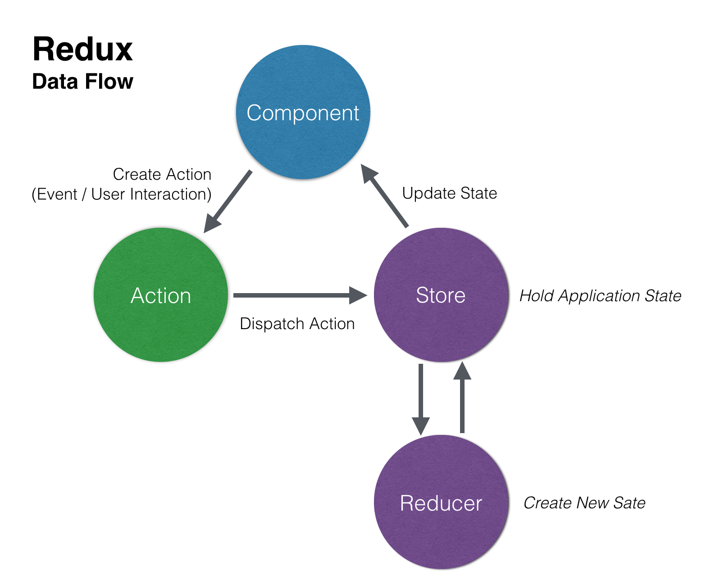

# Redux

- [Redux](#redux)
	- [Sources](#sources)
	- [Intro](#intro)
		- [Install & Run](#install--run)
		- [Redux DevTools](#redux-devtools)
		- [Redux Toolkit](#redux-toolkit)
		- [Basics](#basics)
			- [Bank analogy](#bank-analogy)
	- [Core Components](#core-components)
		- [State](#state)
		- [Store](#store)
			- [Methods](#methods)
			- [Enhancers](#enhancers)
		- [Reducer](#reducer)
		- [Action](#action)
		- [Example interaction](#example-interaction)
	- [Main Concepts](#main-concepts)
		- [Immutability](#immutability)
		- [Data Flow](#data-flow)
		- [Splitting Reducers](#splitting-reducers)
		- [Reducer composition](#reducer-composition)
		- [Middleware](#middleware)
	- [Practice](#practice)
		- [Redux docs Toto example](#redux-docs-toto-example)

***

## Sources

1. https://youtu.be/YdYyYMFPa44 - Minin tutorial
2. https://github.com/zalmoxisus/redux-devtools-extension#installation - Redux DevTools

***

## Intro

### Install & Run

Client (if you need):

```html
<script src="https://unpkg.com/redux@latest/dist/redux.min.js"></script>
```

Server:

```bash
# Option 1: Quick start
npx create-react-app test --template redux
# OR with TypeScript
npx create-react-app test --template redux-typescript

# Option 2: Add Redux to the existing React project:
npm i redux react-redux @reduxjs/toolkit redux-typescript
```

For React, you have to wrap your root React component with the `<Provider>` component from React-Redux:

```js
ReactDOM.render(
  <Provider store={store}>
    <App />
  </Provider>,
  document.getElementById('root')
)
```

***

### Redux DevTools

If you use `@reduxjs/toolkit`, you already have it installed.

Otherwise:

1. Install the Redux DevTools [browser extension](https://github.com/zalmoxisus/redux-devtools-extension#installation) and change your code to activate it for your local app. 
2. `npm i redux-devtools-extension`
3. 
```js
import { composeWithDevTools } from 'redux-devtools-extension'

const store = createStore(
	rootReducer,
	composeWithDevTools(applyMiddleware(thunk, logger))
)
```

***

### Redux Toolkit 

If you used the Redux template (Option 1), Redux ToolKit is already installed. Otherwise, type:

```bash
npm i @reduxjs/toolkit
```

Redux Toolkit is the recommended way to build production apps with Redux.

It provides a number of useful [functions](https://redux-toolkit.js.org/introduction/getting-started#whats-included):

- `configureStore` is a nice wrapper for `createStore`
- `createReducer` is a good alternative to `switch/case`
- `createAction`
- etc.

***

### Basics 

Redux is a container managing the **global State** of your app. 

It can be used with any framework or without any.

It usually consists of these elements:

- `state` is an object holding some important info about your app
- `store` is a storage for your State
- `action creator` is a function creating Actions
- `action` is an object describing changes to the State
- `reducer` is a function that performs changes to the State, acts like an *event listener* which reacts to the Action it's interested in

Use cases:

1. You have several States in your app
2. The app State is needed in many places of your app
3. The State update logic is complex
5. You need some degree of abstraction for a large app with many devs on it.

#### Bank analogy

Bank is a Store holding the clients' money (States). You go to the bank to withdraw some of your money. But you don't take the money from the storage yourself - you go to a cashier or ATM (Reducer) and perform one of the standard requests (Actions): "WITHDRAW_MONEY". The cashier (Reducer) receives your request (Action), gives you the money and changes your balance (State) to a lower number.

***


## Core Components

### State

A plain JS object with any number of fields.

Not every State in the app should live in Redux - components may have their own inner state that is only used by them.

***

### Store

A container holding the app's global State.

You can only have **a single Store** in your app.

There're 2 ways to create Store:

1. Vanilla Redux `createStore`
2. Redux ToolKit `configureStore` with some extra options

Using `createStore` you can pass an **optional** second argument with some preloaded State:

```js
import { createStore } from 'redux'
import rootReducer from './reducer'

let preloadedState
const persistedTodosString = localStorage.getItem('todos')

if (persistedTodosString) {
  preloadedState = {
    todos: JSON.parse(persistedTodosString)
  }
}

export const store = createStore(rootReducer, preloadedState)
```

Using `configureStore` you have even more flexibility:

```js
import { configureStore } from '@reduxjs/toolkit'
import rootReducer from '../reducer'

let preloadedState
const persistedTodosString = localStorage.getItem('todos')

if (persistedTodosString) {
	preloadedState = {
		todos: JSON.parse(persistedTodosString)
	}
}

export const store = configureStore({
	reducer: rootReducer,
	preloadedState
})
```

***

**Never directly change the State inside the Store.**

To change the State:

1. create an **Action object** describing the changes, and **dispatch** it to the Store
2. when the Action is dispatched, the Store runs the root **Reducer function** which **calculates the new State** based on the old State and the Action
3. the Store **notifies subscribers** about the State updates so they can render the changes

***

#### Methods

- `dispatch(action)` - This method is **the only way to update the State**. It makes the Store run its Reducer to update the State.
- `getState()` - Returns the current State.
- `subscribe(cb)` - `cb` will be called each time the State is updated. Returns the `unsubscribe` function that can be called to unregister listeners. 

***

A simplified Store inside looks like this:

```js
function createStore(reducer, preloadedState) {
  let state = preloadedState
  const listeners = []

  function getState() {
    return state
  }

  function subscribe(listener) {
    listeners.push(listener)
    return function unsubscribe() {
      const index = listeners.indexOf(listener)
      listeners.splice(index, 1)
    }
  }

  function dispatch(action) {
    state = reducer(state, action)
    listeners.forEach(listener => listener())
  }

  dispatch({ type: '@@redux/INIT' })

  return { dispatch, subscribe, getState }
}
```

***

#### Enhancers

A wrapper for the Store changing the way it behaves.

Example enhancers:

```js
// This enhancer logs 'Hi' to the console on each `dispatch`
export const sayHiOnDispatch = (createStore) => {
  return (rootReducer, preloadedState, enhancers) => {
    const store = createStore(rootReducer, preloadedState, enhancers)

    function newDispatch(action) {
			// Add new features
      console.log('Hi!')
			// ... and forward the request to the Store the usual way
      const result = store.dispatch(action)
      return result
    }

    return { ...store, dispatch: newDispatch }
  }
}
// This enhancer adds `{ meaningOfLife: 42 }` with each `getState()` response
export const includeMeaningOfLife = (createStore) => {
  return (rootReducer, preloadedState, enhancers) => {
    const store = createStore(rootReducer, preloadedState, enhancers)

    function newGetState() {
      return {
				// Get results from the Store the usual way
        ...store.getState(),
				// And add new features
        meaningOfLife: 42,
      }
    }

    return { ...store, getState: newGetState }
  }
}
```

Using enhancers:

```js
// createStore
import { createStore, compose } from 'redux'
import rootReducer from './reducer'
import {sayHiOnDispatch, includeMeaningOfLife } from './exampleAddons/enhancers'

// Option 1: 
const composedEnhancer = compose(sayHiOnDispatch, includeMeaningOfLife)
const store = createStore(rootReducer, undefined, composedEnhancer)

// Option 2:
export const store = configureStore({
	reducer: rootReducer,
	preloadedState,
	enhancers: [sayHiOnDispatch, includeMeaningOfLife]
})
```

***

### Reducer

A function that returns the new State (or the old one if nothing has changed).

Reducer is a **pure function**, it accepts `(currentState, action)` as parameters and calculates the new State using these parameters only. 

Never modify the existing State, only make **immutable updates** by copying the existing State, changing and returning the copy. You must make a copy of **every** level of nesting that needs to be updated, Redux ToolKit helps writing the update logic.

`createStore` accepts only one Reducer, so if we have several Reducers, we have to unite them into a single `rootReducer`.

***

### Action

An object/function telling the Store how to update State. Like the State data, Action should contain the smallest amount of information needed to describe what happened.

Properties:

- `type: string` - a readable name
- `payload: any` - optional data

**Action creator** - a function creating Actions.

***

### Example interaction

```js
// === Store ===
const store = Redux.createStore(rootReducer)
// or the better way
import { configureStore } from '@reduxjs/toolkit'
const store = configureStore({ reducer: counterReducer })

// === State ===
const initialState = {
	value: 0
}

// === Reducer ===
function counterReducer(state = initialState, action){
	switch(action.type){
		case 'counter/increment':
			return {...state, value: state.value + 1}
		case 'counter/decrement':
			return {...state, value: state.value - 1}
		default:
			return state
	}
}

// === Action ===
const action = {
	type: 'counter/decrement',
	payload: null	// In practice, you just don't mention payload if you don't need it
}

// Chenge the state
store.dispatch(action)
```

***


## Main Concepts

### Immutability

State updates in Redux are **immutable**. 

You have to **make a copy** of the existing State object, modify and save it. **Modifying the existing object is not enough!**

```js
// In a Reducer...

// BAD
case 'counter/increment':
	state.value++

// GOOD
case 'counter/increment':
	return { ...state, value: state.value + 1 }
```

***

### Data Flow

Redux uses a "one-way data flow" app structure.



Basic idea:

- State describes the condition of the app at a specific point in time
- The UI is rendered based on that State
- When something happens (such as user clicking a button), the State is updated based on what has happened
- The UI re-renders based on the new State

Redux in details:

- Initial setup:
  - A Store is created using a root Reducer function
  - The Store calls the root Reducer once, and saves the return value as its initial State
  - When the UI is first rendered, UI components access the current State of the Redux Store, and use that data to decide what to render. They also subscribe to any future Store updates so they can know if the State has changed.
- Updates:
  - Something happens in the app, such as user clicking a button
	- The app code dispatches an Action to the Redux Store, like `dispatch({ type: 'counter/incremented' })`
	- The Store runs the Reducer function again with the previous State and the current Action, and saves the return value as the new State
	- The Store notifies all parts of the UI that are subscribed that the Store has been updated
	- Each UI component that needs data from the Store checks to see if the parts of the State they need have changed
	- Each component that sees its data has changed, forces a re-render with the new data

Action dispatch in details:

1. Enhancers run
2. 1st middleware runs
3. 2nd middleware runs
4. ...
5. 2nd middleware finishes
6. 1st middleware finishes
7. `dispatch(action)` is actually called

***

### Splitting Reducers

Huge Reducers with complex logic handling a lot of Actions are hard to comprehend. That's why they are usually split into multiple smaller Reducer functions.

Reducer for a specific section of the Redux app State is called a **"slice reducer"**.

Its name typically starts with a feature name and then describes the event that happened (e.g. `todos/todoAdded`, `filters/statusFilterChanged`).

From the terrible nested logic like this:

`src/reducers.js`

```js
export default function appReducer(state = initialState, action) {
	switch (action.type) {
		case 'todos/todoAdded':
			return {
				...state,
				todos: [
					...state.todos,
					{
						id: nextTodoId(state.todos),
						text: action.payload,
						completed: false
					}
				]
			}
		case 'todos/todoToggled':
			return {
				...state,
					todos: state.todos.map((todo) => {
						if (todo.id !== action.payload) {
						return todo
					}

					return {
						...todo,
						completed: !todo.completed
					}
				})
			}
		case 'filters/statusFilterChanged':
			return {
				...state,
				filters: {
					...state.filters,
					status: action.payload
				}
			}
		default:
			return state
	}
}
```

To these consice specific Reducers: 

`src/features/todos/todosSlice.js`

```js
export default function todosReducer(state = initialState, action) {
  switch (action.type) {
    case 'todos/todoAdded': {
      // Can return just a new todos array - no extra object around it
      return [
        ...state,
        {
          id: nextTodoId(state),
          text: action.payload,
          completed: false
        }
      ]
    }
    case 'todos/todoToggled': {
      return state.map(todo => {
        if (todo.id !== action.payload) {
          return todo
        }

        return {
          ...todo,
          completed: !todo.completed
        }
      })
    }
    default:
      return state
  }
}
```

`src/features/todos/filtersSlice.js`

```js
const initialState = {
	status: 'All',
	colors: []
}

export default function filtersReducer(state = initialState, action) {
	switch (action.type) {
		case 'filters/statusFilterChanged': {
			return {
				// Again, one less level of nesting to copy
				...state,
				status: action.payload
			}
		}
		default:
			return state
	}
}
```

See the next chapter to find out how to combine these Reducers.

***

### Reducer composition

As the Store can only accept **a single** Reducer, we need to **combine** our two Reducers.

**NB**: Each of these Reducers is managing its own part of the global State. The State parameter is different for every Reducer, and corresponds to the part of the State it manages.

`src/reducer.js`

```js
import todosReducer from './features/counter/todos/todoSlice'
import filtersReducer from './features/filters/filterSlice'

export default function rootReducer(state = {}, action) {
	// always return a new object for the root State
	return {
		// the value of `state.todos` is whatever the todosReducer returns
		todos: todosReducer(state.todos, action),
		// For both Reducers, we only pass in their slice of the state
		filters: filtersReducer(state.filters, action)
	}
}
```

Or we can use `combineReducers()` method from `redux` to do it for us:

```js
import { combineReducers } from 'redux'
import todosReducer from './features/counter/todos/todoSlice'
import filtersReducer from './features/filters/filterSlice'

export default combineReducers({
	todos: todosReducer,
	filters: filtersReducer
})
```

The key names you give to `combineReducers()` decide what the key names of your State object will be.

***

### Middleware

Redux [middleware](https://redux.js.org/tutorials/fundamentals/part-4-store#middleware) provides a third-party extension point **between** dispatching Action, and the moment it reaches the Reducer.

When we call `store.dispatch(action)`, we're actually calling **the first middleware in the pipeline**.

Unlike a reducer, **middleware can have side effects** inside.

Often used for side-effects:

- logging and crash reporting
- async actions (setting timers or making API calls)
- routing
- pausing or even stopping the Action

Redux middleware are written as a series of **three nested functions**.

Each middleware follows the template:

```js
const anotherExampleMiddleware = storeAPI => next => action => {
  // Do something in here, when each action is dispatched
  return next(action)
}
```

Example - logger:

```js
// The outer function is actually the middleware itself, it will be called once
function logger(store) {
	// This wrapper will be called once; `next(action)` will turn into `dispatch(action)` if this is the last middleware in the pipeline
	return function wrapDispatch(next) {
		// The inner function will be called on every action dispatch
		return function handleAction(action) {
			console.log('state: ', store.getState())
			console.log('action: ', action)
			return next(action)
		}
	}
}
```

Example - async code in case of some specific Action, a widespread usecase:

```js
const delayedMessageMiddleware = storeAPI => next => action => {
  if (action.type === 'todos/todoAdded') {
    setTimeout(() => {
      console.log('Added a new todo: ', action.payload)
    }, 1000)
  }

  return next(action)
}
```

We use a special built-in enhancer `applyMiddleware()` to attach middleware to the chain.

```js
// Option 1:
import { applyMiddleware, createStore } from 'redux'
export const store = createStore(
	rootReducer, 
	0, // initial State
	applyMiddleware(thunk, logger)
)

// Option 2:
import { configureStore } from '@reduxjs/toolkit'
export const store = configureStore({
	reducer: rootReducer,
	middleware: [print1, print2, print3],
	preloadedState,
	enhancers: [sayHiOnDispatch, includeMeaningOfLife]
})
```

***


## Practice

### Redux docs Toto [example](https://redux.js.org/tutorials/fundamentals/part-3-state-actions-reducers)

Plan:

- todos are the **app State**
- filtering values are the **UI State**
- ID, text, completed status and optional color are each **component's inner State**

Filtering options:

- the current "completed" filter value
- an array of the currently selected color categories

Example of State:

```js
const todoAppState = {
  todos: [
    { id: 0, text: 'Learn React', completed: true },
    { id: 1, text: 'Learn Redux', completed: false, color: 'purple' },
    { id: 2, text: 'Build something fun!', completed: false, color: 'blue' }
  ],
  filters: {
    status: 'Active',
    colors: ['red', 'blue']
  }
}
```

Next, we should think about Actions:

- add a new todo based on the entered text
- toggle the completed status of a todo
- select a color category for a todo
- delete a todo
- mark all todos as completed
- remove all completed todos
- choose a different "completed" filter
- choose a different color filter
- remove a color filter

Example of actions:

```js
{type: 'todos/todoAdded', payload: todoText}
{type: 'todos/todoToggled', payload: todoId}
{type: 'todos/colorSelected', payload: {todoId, color}}
{type: 'todos/todoDeleted', payload: todoId}
{type: 'todos/allCompleted'}
{type: 'todos/completedCleared'}
{type: 'filters/statusFilterChanged', payload: filterValue}
{type: 'filters/colorFilterChanged', payload: {color, changeType}}
```