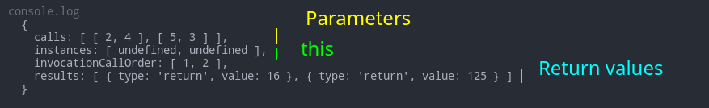
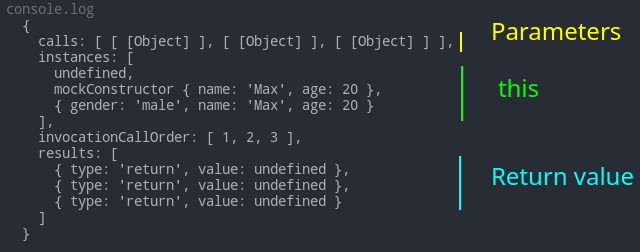
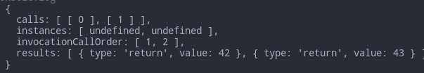
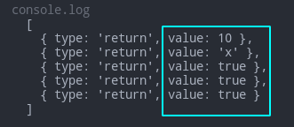
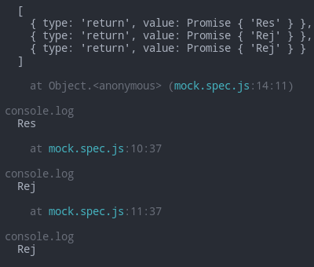

# Jest

- [Jest](#jest)
	- [Sources](#sources)
	- [Intro](#intro)
		- [Basics](#basics)
		- [Install & Run](#install--run)
			- [Global install](#global-install)
			- [Minimalistic project init](#minimalistic-project-init)
			- [Autocomplete](#autocomplete)
			- [Configuration file](#configuration-file)
			- [Babel & TypeScript](#babel--typescript)
	- [Practice](#practice)
		- [The simplest custom testing function](#the-simplest-custom-testing-function)
		- [Basic Jest example](#basic-jest-example)
		- [Other examples](#other-examples)
	- [Mock](#mock)
		- [Basics](#basics-1)
		- [Mock Return Values](#mock-return-values)
		- [Mocking Modules](#mocking-modules)
	- [Snapshots](#snapshots)
	- [Error handling](#error-handling)
		- [SyntaxError: Unexpected token 'export'](#syntaxerror-unexpected-token-export)
		- [Warning: An update to Component inside a test was not wrapped in `act(...)`](#warning-an-update-to-component-inside-a-test-was-not-wrapped-in-act)
	- [Cheat sheet](#cheat-sheet)
		- [Test structure](#test-structure)
			- [Skipping tests](#skipping-tests)
		- [Matchers](#matchers)
			- [Basic matchers](#basic-matchers)
			- [Truthiness](#truthiness)
			- [Numbers](#numbers)
			- [Strings](#strings)
			- [Arrays](#arrays)
			- [Objects](#objects)
			- [Exceptions](#exceptions)
			- [Snapshots](#snapshots-1)
			- [Mock functions](#mock-functions)
			- [Misc](#misc)
			- [Promise matchers](#promise-matchers)
		- [Async tests](#async-tests)
			- [async/await](#asyncawait)
			- [Promises](#promises)
			- [done()](#done)
		- [Mocks](#mocks)
			- [Mock functions](#mock-functions-1)
			- [Returning, resolving and rejecting values](#returning-resolving-and-rejecting-values)
			- [Mock modules using `jest.mock` method](#mock-modules-using-jestmock-method)
			- [Mock modules using a mock file](#mock-modules-using-a-mock-file)
			- [Mock object methods](#mock-object-methods)
			- [Mock getters and setters](#mock-getters-and-setters)
			- [Clearing and restoring mocks](#clearing-and-restoring-mocks)
			- [Accessing the original module when using mocks](#accessing-the-original-module-when-using-mocks)
			- [Timer mocks](#timer-mocks)
		- [Data-driven tests](#data-driven-tests)
		- [Testing modules with side effects](#testing-modules-with-side-effects)
		- [Usage with Babel and TypeScript](#usage-with-babel-and-typescript)

***


## Sources

1. https://hackr.io/blog/types-of-software-testing - testing in general
2. https://jestjs.io/docs/getting-started - jest docs
3. https://youtu.be/IEDe8jl5efU - minin
4. https://github.com/sapegin/jest-cheat-sheet - **cheat sheet**

***


## Intro

### Basics

1. https://hackr.io/blog/types-of-software-testing

(unfinished)

There're different kinds of testing:

- Jest is a **Unit-testing** lib. This means it tests functions as separate entities. 
- **Visual regression testing** tools take screenshots of web pages and compare the resulting images pixel by pixel.
- etc.

**TDD** (test-driving development) - is a development technique where you first write a test (that fails at this point) before you write new functional code.

***

### Install & Run

#### Global install

Use it only once.

```bash
sudo npm i jest -g
```

#### Minimalistic project init

```bash
npm init
npm i -D jest	@types/jest
```

Ensure your `package.json` has this minimal configuration:

```json
{
	"license": "ISC",
	"scripts": {
		"test": "jest"
	},
	"devDependencies": {
		"@types/jest": "^26.0.23",
		"jest": "^27.0.4"
	}
}
```

#### Autocomplete

To add **autocomplete**, create `jsconfig.json` file in the root of your project and put `{ "typeAcquisition": { "include": ["jest"] } }` into it.

Restart VS Code.

#### Configuration file

You can run this [command](https://jestjs.io/docs/getting-started#additional-configuration) to create a config file for your project using a poll:

```bash
jest --init
```

#### Babel & TypeScript

TypeScript is added along with Babel.

```bash
yarn add --dev babel-jest @babel/core @babel/preset-env @babel/preset-typescript @types/jest
```

Create a configuration file `babel.config.js` in the root of your project:

```js
module.exports = {
	presets: [
		['@babel/preset-env', { targets: { node: 'current' } }],
		'@babel/preset-typescript'
	]
}
```

***


## Practice

### The simplest custom testing function

This function is **not** Jest yet and is only here for demonstration purposes.

`script.js`

```js
function expect(value) {
	return {
		toBe: (exp) => {
			if (value === exp) {
				console.log('Success')
			} else {
				console.error(`The value is ${value} but expected ${exp}`)
			}
		}
	}
}

const sum = (a, b) => a + b

expect(sum(3, 6)).toBe(9)		// Success
expect(sum(3, 6)).toBe(10)	// The value is 9 but expected 10
```

Run it with `node script.js` and see the result in the console.

The actual Jest `expect` function works similarly.

***

### Basic Jest example

1. Perform a [minimalistic project init](#minimalistic-project-init)

2. Add `jsconfig.json` according to the [Autocomplete](#autocomplete) chapter.

3. Add these files to your project:

`sum.js`

```js
const sum = (a, b) => a + b
module.exports = sum
```

`sum.test.js` - it's important to name your test files by this convention (using `test` or `spec` as a middle namw)

```js
const sum = require('./sum')

test('adds 1 + 2 to equal 3', () => {
	expect(sum(1, 2)).toBe(3)
	expect(sum(1, 2)).toEqual(3)
})
```

4. Run it: 

```bash
yarn test
# npm test
# npm run test
```

You should see a message about successful tests passed in the console.

***

### Other examples

See the `Projects/Jest` folder for the working examples of vanilla Jest.

***


## Mock

### Basics

Mock is a wrapper around function able to intercept function calls and to provide us analytics about them.

The function gets the `.mock` property which is getting filled with useful data each time the mock is called:

- parameters of the mock calls
- `this`
- returned values

**Example 1** - simple mock function

```js
test('Mock test', () => {
	const myMock = jest.fn((m, n) => m ** n)
	myMock(2, 4) // 16
	myMock(5, 3) // 125
	console.log(myMock.mock)
})
```



**Example 2** - custom `this` and constructor

```js
test('Mock test', () => {
	function User({ name, age }) {
		this.name = name
		this.age = age
	}

	const mockUser = jest.fn(User)

	// 1: simple call
	mockUser({ name: 'Max', age: 20 })
	// 2: constructor
	new mockUser({ name: 'Max', age: 20 })
	// 3: custom `this`
	mockUser.call({ gender: 'male' }, { name: 'Max', age: 20 })

	console.log(mockUser.mock)
})
```



**Example 3** - complete practical exapmle

`ForEach.js`

```js
function forEach(array, cb) {
	for (const item of array) {
		cb(item)
	}
}

module.exports = forEach
```

`mock.test.js`

```js
const forEach = require('./ForEach')

describe('Custom `forEach` function', () => {
	test('Mock parameters test', () => {
		// We define a mock function for testing
		const mockCallback = jest.fn((x) => 42 + x)
		forEach([0, 1], mockCallback)

		// See the contents of our mock after 2 calls
		console.log(mockCallback.mock)

		// The mock function is called twice
		expect(mockCallback.mock.calls.length).toBe(2)

		// The 1st argument of the 1st call to the mock function was 0
		expect(mockCallback.mock.calls[0][0]).toBe(0)

		// The 1st argument of the 2nd call to the mock function was 1
		expect(mockCallback.mock.calls[1][0]).toBe(1)

		// The return value of the 1st call to the mock function was 42
		expect(mockCallback.mock.results[0].value).toBe(42)
	})
})
```



***

### Mock Return Values

Mock can be said to return specific values for different calls - to test our main function.

```js
test('Mock test', () => {
	const myMock = jest.fn()

	myMock
		.mockReturnValueOnce(10)
		.mockReturnValueOnce('x')
		.mockReturnValue(true)

	myMock()
	myMock()
	myMock()
	myMock()
	myMock()

	console.log(myMock.mock.results)
})
```



The same works for Promises:

```js
test('Mock test', () => {
	const myMock = jest.fn((value) => console.log(value))

	myMock.mockResolvedValueOnce('Res')
	myMock.mockResolvedValue('Rej')

	myMock().then((result) => console.log(result))	// Res
	myMock().then((result) => console.log(result))	// Rej
	myMock().then((result) => console.log(result))	// Rej

	console.log(myMock.mock.results)
})
```



***

### Mocking Modules

Performing the actual network requests for testing makes slow and fragile tests.

In practice, the actual requests **are not performed**! Instead, the mock returns a substitute value.

See the [03.async] project for a full example.

***


## Snapshots

See the `jest-react` compendium.

***


## Error handling

### SyntaxError: Unexpected token 'export'

[StackOverflow](https://stackoverflow.com/questions/49263429/jest-gives-an-error-syntaxerror-unexpected-token-export)

You're using ES6 modules that Node.js cannot handle.

```js
// Change this
export default sum

// to this
module.exports = sum
```

***

### Warning: An update to Component inside a test was not wrapped in `act(...)`

1. [Link 1](https://dev.to/il3ven/fix-warning-in-react-update-was-not-wrapped-in-act-bk6)
2. [Link 2](https://kentcdodds.com/blog/fix-the-not-wrapped-in-act-warning)

You're using tests that can miss some errors.

In practice, your component probably performs some state change after the test has finished running. 

You should make sure tests finish **after** all the state changes have been done.

`Todo.tsx`:

```ts
import React, { useEffect, useState } from 'react'
import axios from 'axios'

function Todo() {
	const [todo, setTodo] = useState('')

	useEffect(() => {
		const fetch = async () => {
			const _todo = (
				await axios.get(`https://jsonplaceholder.typicode.com/todos/1`)
			).data
			setTodo(_todo.title)
		}

		fetch()
	}, [])

	return (
		<div>
			<h1>Todo</h1>
			<h2 data-testid="title">Title: {todo}</h2>
		</div>
	)
}
```

Incomplete `Todo.test.js`:

```js
import { render, screen } from '@testing-library/react'
import axios from 'axios'
import Todo from './Todo'

jest.mock('axios')

test('Renders Todo', async () => {
	axios.get.mockImplementation(() => {
		return {
			data: {
				userId: 1,
				id: 1,
				title: 'delectus aut autem',
				completed: false
			}
		}
	})

	render(<Todo />)

	expect(screen.getByText(/Todo/i)).toBeInTheDocument()
})
```

How our test works now? 

1. The component is rendered
2. The test successfully finds the component on the page **and finishes**.
3. The component performs an async state update. But the test has already finished so we can't test the update!

We should also test the correct state **after** we requested and received the data.

```js
expect(screen.getByTestId('title').innerHTML).toBe('Title: delectus aut autem')
```

But this won't work since the request/response is **async** while our tests are **sync**. We need to use the `waitFor` async wrapper. It will wait for async changes (or reject after a timeout).

Complete `Todo.test.js`:

```js
// Todo.test.js
import { render, screen, waitFor } from '@testing-library/react'
import axios from 'axios'
import Todo from './Todo'

jest.mock('axios')

test('renders learn react link', async () => {
	axios.get.mockImplementation(() => {
		return {
			data: {
				userId: 1,
				id: 1,
				title: 'delectus aut autem',
				completed: false
			}
		}
	})

	render(<Todo />)

	expect(screen.getByText(/Todo/i)).toBeInTheDocument()
	// Our async test
	await waitFor(() => {
		expect(screen.getByTestId('title').innerHTML).toBe(
			'Title: delectus aut autem'
		)
	})
})
```

***


## Cheat sheet

### Test structure

```js
describe('makePoniesPink', () => {
  beforeAll(() => {
    /* Runs before all tests */
  })
  afterAll(() => {
    /* Runs after all tests */
  })
  beforeEach(() => {
    /* Runs before each test */
  })
  afterEach(() => {
    /* Runs after each test */
  })

  test('make each pony pink', () => {
    const actual = fn(['Alice', 'Bob', 'Eve'])
    expect(actual).toEqual(['Pink Alice', 'Pink Bob', 'Pink Eve'])
  })
})
```

#### Skipping tests

For testing purposes, you may want to run some tests separately from others. The easy way to change them is to use `only` or `skip` modifiers.

```js
// These tests will be skipped
describe.skip('makePoniesPink', () => {})
test.skip('make each pony pink', () => {})

// Only these tests will run
describe.only('makePoniesPink', () => {})
test.only('make each pony pink', () => {})
```

***

### Matchers

[Using matchers](http://jestjs.io/docs/en/using-matchers), [matchers docs](https://jestjs.io/docs/en/expect)

#### Basic matchers

```js
expect(42).toBe(42)			// Strict equality (===)
expect(42).not.toBe(3)	// Strict equality (!==)
expect([1, 2]).toEqual([1, 2])	// Deep equality
expect({ a: undefined, b: 2 }).toEqual({ b: 2 })	// Deep equality
expect({ a: undefined, b: 2 }).not.toStrictEqual({ b: 2 })	// Strict equality
```

#### Truthiness

```js
expect('foo').toBeTruthy()
expect('').toBeFalsy()
expect(null).toBeNull()
expect(undefined).toBeUndefined()
expect(7).toBeDefined()
expect(true).toEqual(expect.any(Boolean))	// Boolean type
```

#### Numbers

```js
expect(2).toBeGreaterThan(1)
expect(1).toBeGreaterThanOrEqual(1)
expect(1).toBeLessThan(2)
expect(1).toBeLessThanOrEqual(1)
expect(0.2 + 0.1).toBeCloseTo(0.3, 5)
expect(NaN).toEqual(expect.any(Number))	// Number type
```

#### Strings

```js
expect('long string').toMatch('str')
expect('pizza').not.toMatch('coffee')
expect('coffee').toMatch(/ff/)
expect(['pizza', 'coffee']).toEqual([expect.stringContaining('zz'), expect.stringMatching(/ff/)])
expect('string').toEqual(expect.any(String))	// String type
```

#### Arrays

```js
expect(['Alice', 'Bob', 'Eve']).toHaveLength(3)
expect(['Alice', 'Bob', 'Eve']).toContain('Alice')
expect([{ a: 1 }, { a: 2 }]).toContainEqual({ a: 1 })
expect(['Alice', 'Bob', 'Eve']).toEqual(expect.arrayContaining(['Alice', 'Bob']))
expect([]).toEqual(expect.any(Array))	// Array type
```

#### Objects

```js
expect({ a: 1 }).toHaveProperty('a')
expect({ a: 1 }).toHaveProperty('a', 1)
expect({ a: { b: 1 } }).toHaveProperty('a.b')
expect({ a: 1, b: 2 }).toMatchObject({ a: 1 })
expect({ a: 1, b: 2 }).toMatchObject({
  a: expect.any(Number),
  b: expect.any(Number),
})
expect([{ a: 1 }, { b: 2 }]).toEqual([
  expect.objectContaining({ a: expect.any(Number) }),
  expect.anything()
])
```

#### Exceptions

```js
// const fn = () => { throw new Error('Out of cheese!') }
expect(fn).toThrow()
expect(fn).toThrow('Out of cheese')
// Compares the result to the previously saved snapshot
expect(fn).toThrowErrorMatchingSnapshot()
```

<details>
  <summary>Aliases</summary>

- `toThrowError` → `toThrow`
</details>

#### Snapshots

```js
expect(node).toMatchSnapshot()
expect(user).toMatchSnapshot({
  date: expect.any(Date),
})
expect(user).toMatchInlineSnapshot()
```

#### Mock functions

```js
// const fn = jest.fn()
// const fn = jest.fn().mockName('Unicorn') -- named mock
expect(fn).toBeCalled() // Function was called
expect(fn).not.toBeCalled() // Function was *not* called
expect(fn).toHaveBeenCalledTimes(1) // Function was called only once
expect(fn).toBeCalledWith(arg1, arg2) // Any of calls was with these arguments
expect(fn).toHaveBeenLastCalledWith(arg1, arg2) // Last call was with these arguments
expect(fn).toHaveBeenNthCalledWith(callNumber, args) // Nth call was with these arguments
expect(fn).toHaveReturnedTimes(2) // Function was returned without throwing an error
expect(fn).toHaveReturnedWith(value) // Function returned a value
expect(fn).toHaveLastReturnedWith(value) // Last function call returned a value
expect(fn).toHaveNthReturnedWith(value) // Nth function call returned a value
expect(fn.mock.calls).toEqual([
  ['first', 'call', 'args'],
  ['second', 'call', 'args'],
]) // Multiple calls
expect(fn.mock.calls[0][0]).toBe(2) // fn.mock.calls[0][0] — the first argument of the first call
```

<details>
  <summary>Aliases</summary>

- `toBeCalled` → `toHaveBeenCalled`
- `toBeCalledWith` → `toHaveBeenCalledWith`
- `lastCalledWith` → `toHaveBeenLastCalledWith`
- `nthCalledWith` → `toHaveBeenNthCalledWith`
- `toReturnTimes` → `toHaveReturnedTimes`
- `toReturnWith` → `toHaveReturnedWith`
- `lastReturnedWith` → `toHaveLastReturnedWith`
- `nthReturnedWith` → `toHaveNthReturnedWith`
</details>

#### Misc

```js
expect(new A()).toBeInstanceOf(A)
expect(() => {}).toEqual(expect.any(Function))
expect('pizza').toEqual(expect.anything())
```

#### Promise matchers

```js
test('resolve to lemon', () => {
  expect.assertions(1)
  // Make sure to add a return statement
  return expect(Promise.resolve('lemon')).resolves.toBe('lemon')
  return expect(Promise.reject('octopus')).rejects.toBeDefined()
  return expect(Promise.reject(Error('pizza'))).rejects.toThrow()
})

test('resolve to lemon', async () => {
  expect.assertions(2)
  await expect(Promise.resolve('lemon')).resolves.toBe('lemon')
  await expect(Promise.resolve('lemon')).resolves.not.toBe('octopus')
})
```

[resolves docs](https://jestjs.io/docs/en/expect#resolves)

***

### Async tests

See [more examples](https://jestjs.io/docs/en/tutorial-async) in Jest docs.

It’s a good practice to specify a number of expected assertions in async tests, so the test will fail if your assertions weren’t called at all.

```js
test('async test', () => {
  expect.assertions(3) // 3 tests pass
  expect.hasAssertions() // at least 1 test pass

  // Your async tests
})
```

Note that you can also do this per file, outside any `describe` and `test`:

```js
beforeEach(expect.hasAssertions)
```

#### async/await

```js
// Expect success
test('async test', async () => {
  expect.assertions(1)
  const result = await runAsyncOperation()
  expect(result).toBe(true)
})

// Expect error
test('the fetch fails with an error', async () => {
  expect.assertions(1)
  try {
    await fetchData()
  } catch (e) {
    expect(e).toMatch('error')
  }
})
```

#### Promises

_Return_ a Promise from your test:

```js
test('async test', () => {
  expect.assertions(1)
  return runAsyncOperation().then((result) => {
    expect(result).toBe(true)
  })
})

test('the data is peanut butter', () => {
	expect.assertions(1)
  return expect(fetchData()).resolves.toBe('peanut butter');
})
```

#### done()

Works as `resolve` for Promises.

Using `try..catch` is mandatory here.

```js
test('the data is peanut butter', done => {
	// This callback will be called when async function is finished
  function callback(data) {
    try {
      expect(data).toBe('peanut butter')
      done()
    } catch (error) {
      done(error)
    }
  }

  fetchData(callback)
})
```

***

### Mocks

#### Mock functions

```js
test('call the callback', () => {
  const callback = jest.fn()
  fn(callback)
  expect(callback).toBeCalled()
  expect(callback.mock.calls[0][1].baz).toBe('pizza') // Second argument of the first call
  // Match the first and the last arguments but ignore the second argument
  expect(callback).toHaveBeenLastCalledWith('meal', expect.anything(), 'margarita')
})
```

You can also use snapshots:

```js
test('call the callback', () => {
  const callback = jest.fn().mockName('Unicorn') // mockName is available in Jest 22+
  fn(callback)
  expect(callback).toMatchSnapshot()
  // ->
  // [MockFunction Unicorn] {
  //   "calls": Array [
  // ...
})
```

And pass an implementation to `jest.fn` function:

```js
const callback = jest.fn(() => true)
```

[Mock functions docs](https://jestjs.io/docs/en/mock-function-api)

#### Returning, resolving and rejecting values

Your mocks can return values:

```js
const callback = jest.fn().mockReturnValue(true)
const callbackOnce = jest.fn().mockReturnValueOnce(true)
```

Or resolve values:

```js
const promise = jest.fn().mockResolvedValue(true)
const promiseOnce = jest.fn().mockResolvedValueOnce(true)
```

They can even reject values:

```js
const failedPromise = jest.fn().mockRejectedValue('Error')
const failedPromiseOnce = jest.fn().mockRejectedValueOnce('Error')
```

You can even combine these:

```js
const callback = jest.fn().mockReturnValueOnce(false).mockReturnValue(true)

// ->
//  call 1: false
//  call 2+: true
```

#### Mock modules using `jest.mock` method

```js
jest.mock('lodash/memoize', () => (a) => a) // The original lodash/memoize should exist
jest.mock('lodash/memoize', () => (a) => a, { virtual: true }) // The original lodash/memoize isn’t required
```

[jest.mock docs](https://jestjs.io/docs/en/jest-object#jestmockmodulename-factory-options)

> Note: When using `babel-jest`, calls to `jest.mock` will automatically be hoisted to the top of the code block. Use `jest.doMock` if you want to explicitly avoid this behavior.

#### Mock modules using a mock file

1.  Create a file like `__mocks__/lodash/memoize.js`:

    ```js
    module.exports = (a) => a
    ```

2.  Add to your test:

    ```js
    jest.mock('lodash/memoize')
    ```

> Note: When using `babel-jest`, calls to `jest.mock` will automatically be hoisted to the top of the code block. Use `jest.doMock` if you want to explicitly avoid this behavior.

[Manual mocks docs](https://jestjs.io/docs/en/manual-mocks)

#### Mock object methods

```js
const spy = jest.spyOn(console, 'log').mockImplementation(() => {})
expect(console.log.mock.calls).toEqual([['dope'], ['nope']])
spy.mockRestore()
```

```js
const spy = jest.spyOn(ajax, 'request').mockImplementation(() => Promise.resolve({ success: true }))
expect(spy).toHaveBeenCalled()
spy.mockRestore()
```

```js
const location = {}
const getTitle = jest.spyOn(location, 'title', 'get').mockImplementation(() => 'pizza')
const setTitle = jest.spyOn(location, 'title', 'set').mockImplementation(() => {})
```

#### Mock getters and setters

```js
const getTitle = jest.fn(() => 'pizza')
const setTitle = jest.fn()
const location = {}
Object.defineProperty(location, 'title', {
  get: getTitle,
  set: setTitle,
})
```

#### Clearing and restoring mocks

For one mock:

```js
fn.mockClear() // Clears mock usage date (fn.mock.calls, fn.mock.instances)
fn.mockReset() // Clears and removes any mocked return values or implementations
fn.mockRestore() // Resets and restores the initial implementation
```

> Note: `mockRestore` works only with mocks created by `jest.spyOn`.

For all mocks:

```js
jest.clearAllMocks()
jest.resetAllMocks()
jest.restoreAllMocks()
```

#### Accessing the original module when using mocks

```js
jest.mock('fs')
const fs = require('fs') // Mocked module
const fs = require.requireActual('fs') // Original module
```

#### Timer mocks

Write synchronous test for code that uses native timer functions (`setTimeout`, `setInterval`, `clearTimeout`, `clearInterval`).

```js
// Enable fake timers
jest.useFakeTimers()

test('kill the time', () => {
  const callback = jest.fn()

  // Run some code that uses setTimeout or setInterval
  const actual = someFunctionThatUseTimers(callback)

  // Fast-forward until all timers have been executed
  jest.runAllTimers()

  // Check the results synchronously
  expect(callback).toHaveBeenCalledTimes(1)
})
```

Or adjust timers by time with [advanceTimersByTime()](https://jestjs.io/docs/en/timer-mocks#advance-timers-by-time):

```js
// Enable fake timers
jest.useFakeTimers()

test('kill the time', () => {
  const callback = jest.fn()

  // Run some code that uses setTimeout or setInterval
  const actual = someFunctionThatUseTimers(callback)

  // Fast-forward for 250 ms
  jest.advanceTimersByTime(250)

  // Check the results synchronously
  expect(callback).toHaveBeenCalledTimes(1)
})
```

Use [jest.runOnlyPendingTimers()](https://jestjs.io/docs/en/timer-mocks#run-pending-timers) for special cases.

**Note:** you should call `jest.useFakeTimers()` in your test case to use other fake timer methods.

***

### Data-driven tests

Run the same test with different data:

```js
test.each([
  [1, 1, 2],
  [1, 2, 3],
  [2, 1, 3],
])('.add(%s, %s)', (a, b, expected) => {
  expect(a + b).toBe(expected)
})
```

Or the same using template literals:

```js
test.each`
  a    | b    | expected
  ${1} | ${1} | ${2}
  ${1} | ${2} | ${3}
  ${2} | ${1} | ${3}
`('returns $expected when $a is added $b', ({ a, b, expected }) => {
  expect(a + b).toBe(expected)
})
```

Or on `describe` level:

```js
describe.each([['mobile'], ['tablet'], ['desktop']])('checkout flow on %s', (viewport) => {
  test('displays success page', () => {
    //
  })
})
```

[describe.each() docs](https://jestjs.io/docs/en/api#describeeachtablename-fn-timeout), [test.each() docs](https://jestjs.io/docs/en/api#testeachtablename-fn-timeout),

***

### Testing modules with side effects

Node.js and Jest will cache modules you `require`. To test modules with side effects you’ll need to reset the module registry between tests:

```js
const modulePath = '../module-to-test'

afterEach(() => {
  jest.resetModules()
})

test('first test', () => {
  // Prepare conditions for the first test
  const result = require(modulePath)
  expect(result).toMatchSnapshot()
})

test('second text', () => {
  // Prepare conditions for the second test
  const fn = () => require(modulePath)
  expect(fn).toThrow()
})
```

***

### Usage with Babel and TypeScript

Add [babel-jest](https://github.com/facebook/jest/tree/master/packages/babel-jest) or [ts-jest](https://github.com/kulshekhar/ts-jest). Check their docs for installation instructions.

***