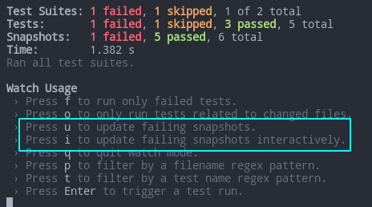

# Jest with React

- [Jest with React](#jest-with-react)

***


## Sources

1. https://reactjs.org/docs/testing-recipes.html - React docs

***


## Intro

### Install % Run

[Docs](https://jestjs.io/docs/tutorial-react)

Add to the existing `CRA` project:

```bash
npm i -D react-test-renderer prettier
# or
# yarn add --dev react-test-renderer prettier
```

Full install:

```bash
npm i -D jest babel-jest @babel/preset-env @babel/preset-react react-test-renderer prettier
# or
# yarn add --dev jest babel-jest @babel/preset-env @babel/preset-react react-test-renderer prettier
```

***

### Basics

There're 2 main categories of tests in React:

- Rendering component trees in a **simplified** test environment - the main way, **fast**
- Running a complete app in a **realistic** browser environment - the final testing beforee production, **slow**

Make sure you attached your component to the `document` so it can receive DOM events.

Also make sure to clean up after each test. 

```js
import { unmountComponentAtNode } from "react-dom";

let container = null;
beforeEach(() => {
  // setup a DOM element as a render target
  container = document.createElement("div")
  document.body.appendChild(container)
});

afterEach(() => {
  // cleanup on exiting
  unmountComponentAtNode(container)
  container.remove()
  container = null
})
```

***

### Snapshots

When we test React, **we don't render the entire App** - it's ineffective. Instead, we quickly generate a serializable value for our React tree.

A typical snapshot test renders a UI component, takes a snapshot, then compares it to a reference snapshot file stored alongside the test: 

- If they **match**, the test passes
- If they **don't match**:
  - either the test runner found a bug in your code that should be fixed
  - or the implementation has changed and the snapshot needs to be updated.

Snapshot features:

- must always represent the current state of the modules it covers
- is created on the first test run
- lives in the `__snapshots__` folder (or inline)
- is scoped to the insides of the component and doesn't know how the component is called in the outer code
- should be committed and updated alongside code changes

**Example**: 

```bash
npx create-react-app react-test --template typescript
cd react-test
npm i -D react-test-renderer prettier
```

Clean up the project and create these files:

`Link.tsx`

```ts
import React, { useState } from 'react'

const STATUS = {
	HOVERED: 'hovered',
	NORMAL: 'normal'
}

const Link: React.FC<{ page: string; children: React.ReactNode }> = ({
	page,
	children
}) => {
	const [status, setStatus] = useState<string>(STATUS.NORMAL)

	const onMouseEnter = () => {
		setStatus(STATUS.HOVERED)
	}

	const onMouseLeave = () => {
		setStatus(STATUS.NORMAL)
	}

	return (
		<a
			className={status}
			href={page || '#'}
			onMouseEnter={onMouseEnter}
			onMouseLeave={onMouseLeave}
		>
			{children}
		</a>
	)
}

export default Link
```

`Link.test.js` (comment all tests except the first one to start small)

```js
import React from 'react'
import Link from './Link'
import renderer from 'react-test-renderer'

it('renders correctly', () => {
	const tree = renderer
		.create(<Link page="https://youtube.com">Youtube</Link>)
		.toJSON()
	expect(tree).toMatchSnapshot()
})

it('renders as an anchor when no page is set', () => {
	const tree = renderer.create(<Link>Facebook</Link>).toJSON()
	expect(tree).toMatchSnapshot()
})

it('properly escapes quotes', () => {
	const tree = renderer
		.create(<Link>{"\"Facebook\" \\'is \\ 'awesome'"}</Link>)
		.toJSON()
	expect(tree).toMatchSnapshot()
})

it('changes the class when hovered', () => {
	const component = renderer.create(
		<Link page="http://www.facebook.com">Facebook</Link>
	)
	let tree = component.toJSON()
	expect(tree).toMatchSnapshot()

	// manually trigger the callback
	tree.props.onMouseEnter()
	// re-rendering
	tree = component.toJSON()
	expect(tree).toMatchSnapshot()

	// manually trigger the callback
	tree.props.onMouseLeave()
	// re-rendering
	tree = component.toJSON()
	expect(tree).toMatchSnapshot()
})
```

**Examine** your snapshot in the `__snapshots__` folder. You should see the footprint that you expected. If not - your code might be not ok.

**Remember**: Test doesn't call or render your actual App! Instead, it imports your component (`Link`) and creates a **mock in a vacuum** using the parameters in `.create()`. 

- If you change `{children}` for `Youtube` in `Link.tsx`, it won't change the test output as it still matches the snapshot.
- If you change props for your `<Link />` in your `<App />`, it won't change the test output as your App is **not** used during the test.

Let's change `Link.tsx`:

```js
// Change this 
{children}
// to this
Youtube
```

The test still passes because the result of running this component matches the snapshot. Another change:

```js
// Change this
Youtube
// to this
Facebook
```

Now it fails because there's "Youtube" in our snapshot. If we want to apply this change, we should update our snapshot.

**To update snapshots**, use the watch mode:



or

```bash
jest -u
```

***

### Property Matchers#

If you try to snapshot objects with **generated** values, they will generate different values on each test and, thus, fail every time. 

```js
it('will fail every time', () => {
	const user = {
		createdAt: new Date(),
		id: Math.floor(Math.random() * 20)
	}

	expect(user).toMatchSnapshot()
})
```

Solution - **asymmetric matchers** that are checked before the snapshot is written or tested, and then saved to the snapshot file instead of the received value.

Regular values that are not matchers, will be saved as usual.

```js
it('will check the matchers and pass', () => {
	const user = {
		createdAt: new Date(),
		id: Math.floor(Math.random() * 20),
		name: 'Max'
	}

	expect(user).toMatchSnapshot({
		createdAt: expect.any(Date),
		id: expect.any(Number)
	})
})
```

The snapshot:

```
exports[`will check the matchers and pass`] = `
Object {
  "createdAt": Any<Date>,
  "id": Any<Number>,
  "name": "Max",
}
`;
```

***